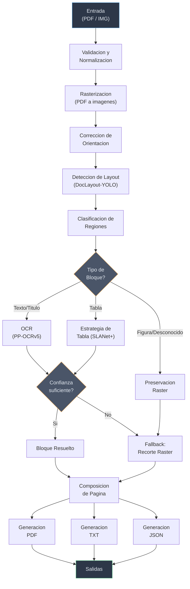
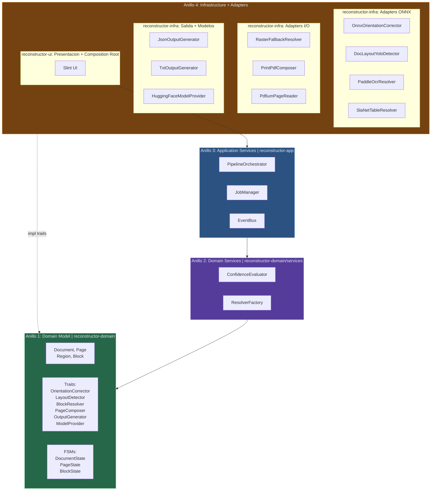
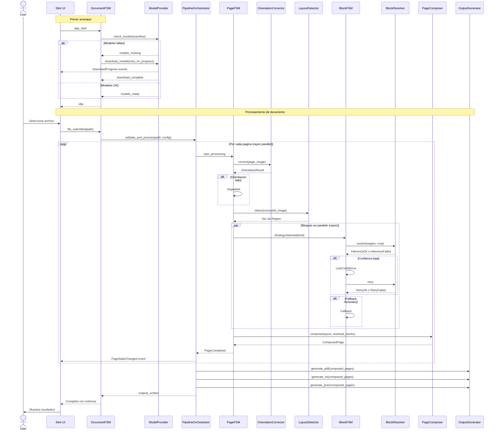
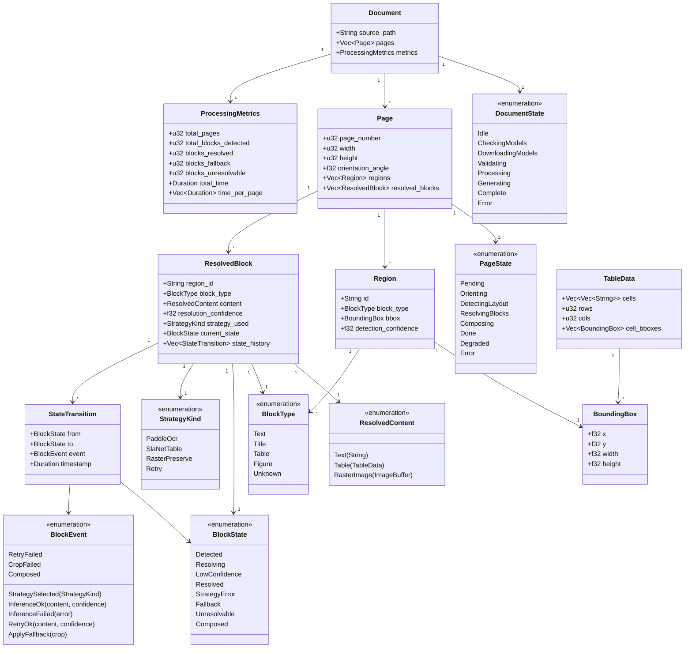
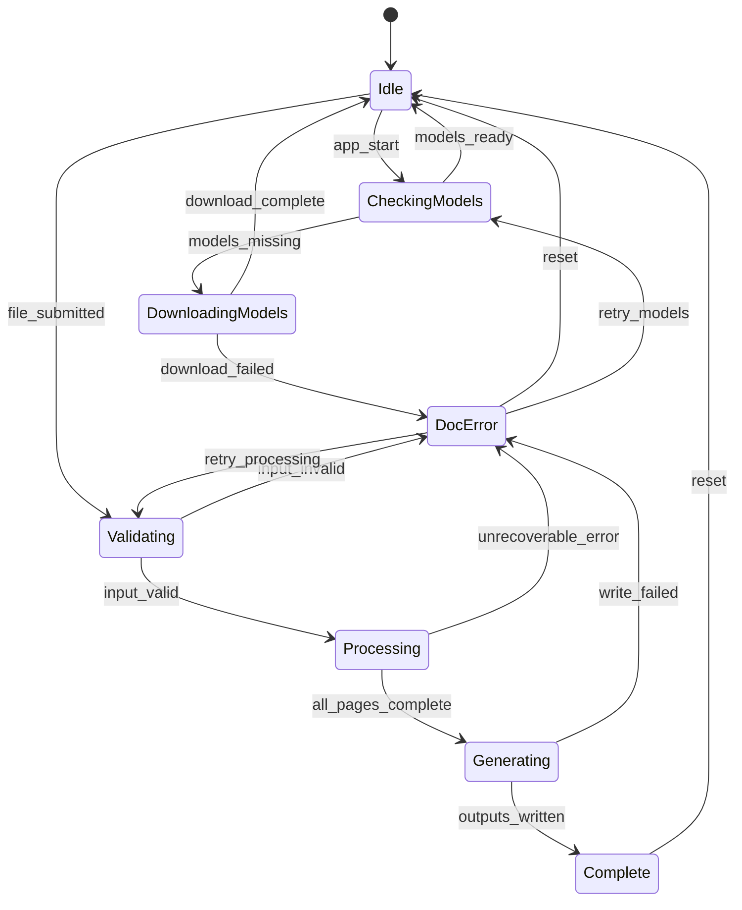
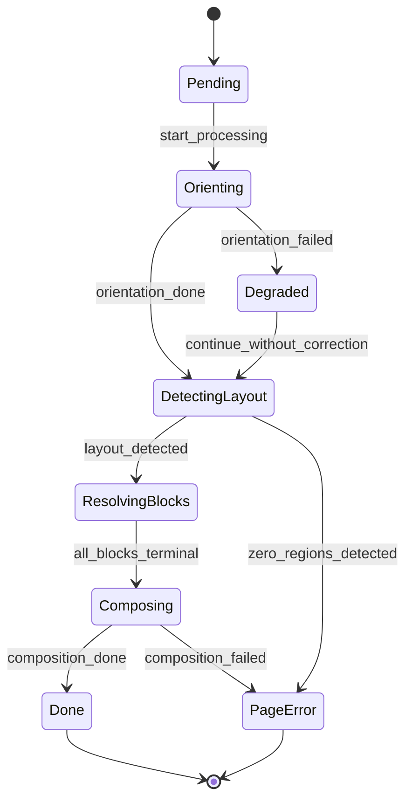
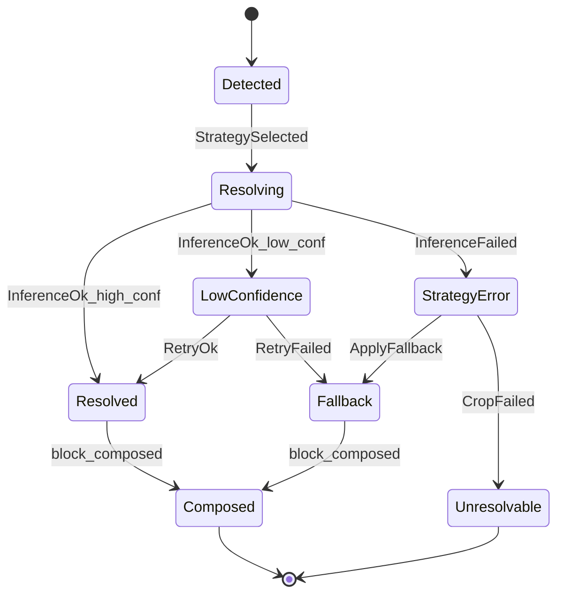
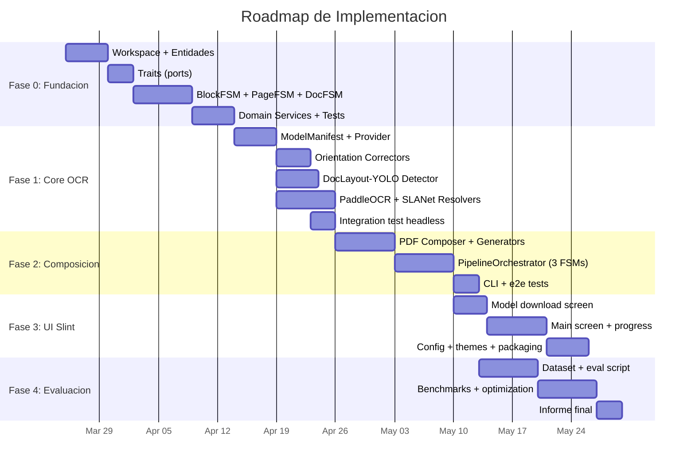
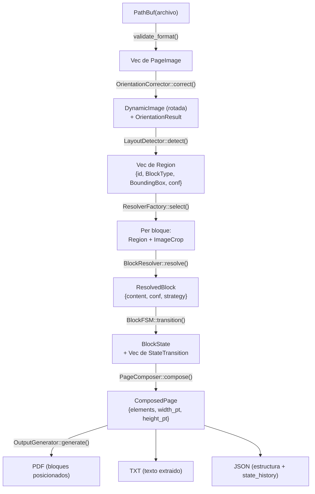

# ReконstructOR — Sistema OCR Multimodelo de Reconstrucción Documental

> **Documento Técnico Integral** — Visión, SRS (ISO 29148), Arquitectura (ISO 42010), Stack Tecnológico y Diseño de Sistema
>
> **Versión:** 1.6.0  
> **Fecha:** 2026-03-21  
> **Clasificación:** Documento de Ingeniería — Uso Interno / Académico  
> **Changelog v1.6.0:** Ejemplo end-to-end trazado con documento real recorriendo los 3 FSMs (§16). Diagrama de flujo de datos struct-a-struct (§17). 6 wireframes de UI con mapeo a estados del DocumentFSM (§18). Antes/después visual con 3 vistas del mismo documento (§19).  
> **Changelog v1.5.1:** Diagramas Mermaid corregidos: emojis eliminados, sintaxis reparada.  
> **Changelog v1.5.0:** Glosario 27 términos. Concurrencia. Catálogo de errores. Configuración. Trazabilidad. Distribución.  
> **Changelog v1.4.0:** Roadmap formal con 5 fases y 41 entregables.  
> **Changelog v1.3.0:** Autómata jerárquico 3 niveles. Provisión automática de modelos.  
> **Changelog v1.2.0:** BlockState FSM.  
> **Changelog v1.1.0:** Onion Architecture. Orientación en dos niveles.

---

## Tabla de Contenido

1. [Documento de Visión](#1-documento-de-visión)
2. [Especificación de Requisitos de Software (SRS — ISO 29148)](#2-especificación-de-requisitos-de-software-srs--iso-29148)
3. [Priorización MoSCoW](#3-priorización-moscow)
4. [Propuesta de Stack Tecnológico y Justificación](#4-propuesta-de-stack-tecnológico-y-justificación)
5. [Documento de Arquitectura (ADD — ISO 42010)](#5-documento-de-arquitectura-add--iso-42010)
6. [Diagramas Técnicos (Mermaid)](#6-diagramas-técnicos-mermaid)
7. [Modelado de Datos — Esquema JSON de Salida](#7-modelado-de-datos--esquema-json-de-salida)
8. [Pipeline de Procesamiento — Diseño Detallado](#8-pipeline-de-procesamiento--diseño-detallado)
9. [Estrategia de Fallback y Confianza](#9-estrategia-de-fallback-y-confianza)
10. [Plan de Pruebas y Evaluación](#10-plan-de-pruebas-y-evaluación)
11. [Estructura del Proyecto](#11-estructura-del-proyecto)
12. [Decisiones de Diseño (ADR Log)](#12-decisiones-de-diseño-adr-log)
13. [Roadmap de Implementación](#13-roadmap-de-implementación)
14. [Matriz de Trazabilidad: Requisitos → Componentes → Tests](#14-matriz-de-trazabilidad-requisitos--componentes--tests)
15. [Estrategia de Distribución e Instalación](#15-estrategia-de-distribución-e-instalación)
16. [Ejemplo End-to-End Trazado](#16-ejemplo-end-to-end-trazado)
17. [Diagrama de Flujo de Datos](#17-diagrama-de-flujo-de-datos)
18. [Wireframes de la Interfaz de Usuario](#18-wireframes-de-la-interfaz-de-usuario)
19. [Antes y Después — Reconstrucción Visual](#19-antes-y-después--reconstrucción-visual)

---

## 1. Documento de Visión

### 1.1 Declaración del Problema

Los documentos escaneados o fotografiados pierden su estructura semántica y espacial al ser procesados por herramientas OCR convencionales, que priorizan la extracción de texto plano sin preservar la composición visual del original. Esto genera PDFs ilegibles, tablas destruidas y figuras descartadas.

### 1.2 Visión del Producto

**ReконstructOR** es un sistema de escritorio de alto rendimiento, construido en Rust, que recibe documentos escaneados (imágenes o PDF) y produce una reconstrucción fiel en PDF que respeta la geometría, jerarquía visual y composición de cada página, complementado con salidas auxiliares en TXT y JSON para análisis programático.

### 1.3 Propuesta de Valor

| Dimensión | Valor |
|---|---|
| **Fidelidad** | Reconstrucción espacial basada en coordenadas reales del layout, no superposición de imagen. |
| **Rendimiento** | Pipeline nativo en Rust con inferencia ONNX acelerada por hardware — órdenes de magnitud más rápido que soluciones Python equivalentes. |
| **Modularidad** | Cada etapa del pipeline (orientación, layout, OCR, composición) es un trait intercambiable. |
| **Ejecución Local** | Sin dependencia de APIs externas. Los modelos ONNX corren on-device. |
| **UI Moderna** | Interfaz desktop con Slint que ofrece experiencia visual profesional y feedback en tiempo real del procesamiento. |

### 1.4 Stakeholders

| Stakeholder | Interés |
|---|---|
| **Usuario Final** | Obtener un PDF reconstruido de alta fidelidad a partir de escaneos de baja calidad. |
| **Desarrollador / Investigador** | Extender el pipeline con nuevos modelos, estrategias de resolución o formatos de salida. |
| **Evaluador Académico** | Validar la calidad de reconstrucción mediante métricas y el JSON estructurado. |

### 1.5 Alcance y Exclusiones

**Dentro del alcance:** PDF, TXT y JSON como salidas oficiales. Pipeline multimodelo local. UI de escritorio.

**Fuera del alcance (v1):** Salidas DOCX/LaTeX, edición semántica avanzada, igualación tipográfica exacta, estrategia de PDF sandwich como objetivo principal.

---

## 2. Especificación de Requisitos de Software (SRS — ISO 29148)

### 2.1 Introducción

#### 2.1.1 Propósito

Este documento especifica los requisitos funcionales y no funcionales del sistema ReконstructOR conforme al estándar ISO/IEC/IEEE 29148:2018.

#### 2.1.2 Alcance del Producto

Sistema de escritorio para reconstrucción documental a partir de imágenes/PDF escaneados mediante un pipeline de orientación → layout → resolución por bloque → composición.

#### 2.1.3 Definiciones, Acrónimos y Glosario Técnico

| Término | Definición |
|---|---|
| **OCR** | Optical Character Recognition — Reconocimiento Óptico de Caracteres. |
| **Layout** | Estructura espacial de una página: regiones, coordenadas, tipos de contenido. |
| **Bloque** | Unidad mínima de resolución dentro de una página (región textual, tabla, figura, etc.). |
| **Fallback** | Mecanismo de degradación segura que preserva el recorte raster de un bloque cuando la resolución textual no es confiable. |
| **Confianza** | Score numérico (0.0–1.0) que indica la fiabilidad del resultado de resolución de un bloque. |
| **ONNX** | Open Neural Network Exchange — Formato interoperable de modelos de ML. Permite ejecutar modelos entrenados en PyTorch/TensorFlow en cualquier runtime compatible. |
| **Composición** | Proceso de reensamblar una página PDF a partir de bloques resueltos respetando coordenadas originales. |
| **ONNX Runtime** | Motor de inferencia de Microsoft que ejecuta modelos ONNX con aceleración por hardware (CPU/GPU/TensorRT). En Rust se accede vía el crate `ort`. |
| **FSM** | Finite State Machine — Máquina de Estados Finitos. Modelo matemático de computación con un número finito de estados y transiciones entre ellos. |
| **Trait** | Concepto de Rust equivalente a una interfaz (Java/C#). Define un contrato de métodos que un tipo debe implementar. Un trait no contiene implementación propia (salvo defaults). |
| **Trait Object** | Instancia dinámica de un trait (`Box<dyn Trait>`) que permite polimorfismo en runtime. Equivalente a un puntero a interfaz con vtable para dynamic dispatch. |
| **Composition Root** | Punto único en la aplicación donde se ensamblan todas las dependencias concretas y se inyectan a los componentes. En este proyecto es `reconstructor-ui/src/main.rs`. |
| **Onion Architecture** | Patrón arquitectónico donde el código se organiza en anillos concéntricos. Las dependencias siempre apuntan hacia adentro: el dominio (centro) no conoce la infraestructura (exterior). |
| **Raster** | Imagen representada como una grilla de píxeles (bitmap). Opuesto a vectorial. Un "recorte raster" es un crop rectangular de la imagen original de la página. |
| **NMS** | Non-Maximum Suppression — Algoritmo de post-procesamiento que elimina detecciones duplicadas/solapadas conservando solo la de mayor confianza. |
| **DPI** | Dots Per Inch — Puntos por pulgada. Resolución de rasterización. 300 DPI es el estándar para OCR de calidad. |
| **Reading-order** | Orden natural de lectura de un documento: típicamente top-to-bottom, left-to-right para idiomas occidentales. |
| **Crate** | Unidad de compilación en Rust. Equivalente a un paquete/librería. Cada crate tiene su propio `Cargo.toml` con dependencias. |
| **Workspace** | Conjunto de crates de Rust que comparten un `Cargo.lock` y se compilan juntos. Permite dividir un proyecto en módulos con dependencias controladas. |
| **DynamicImage** | Tipo del crate `image` de Rust que representa una imagen con formato de pixel dinámico (RGB, RGBA, Grayscale, etc.). |
| **ImageBuffer** | Tipo del crate `image` de Rust que representa una imagen con formato de pixel estático y acceso directo a los bytes. |
| **rayon** | Crate de Rust para paralelismo data-parallel. Provee iteradores paralelos (`par_iter()`) que distribuyen trabajo automáticamente en un thread pool. |
| **Backpressure** | Mecanismo que limita la velocidad de producción cuando el consumidor no puede procesar tan rápido. Previene saturación de memoria. |
| **SHA256** | Algoritmo de hash criptográfico que produce un digest de 256 bits. Usado para verificar integridad de archivos descargados. |
| **PageFSM** | Instancia del autómata finito que gobierna el procesamiento de una página individual (8 estados: Pending → Done/Error). |
| **DocumentFSM** | Instancia del autómata finito que gobierna el ciclo de vida completo de un procesamiento (8 estados: Idle → Complete/Error). |
| **BlockFSM** | Instancia del autómata finito que gobierna la resolución de un bloque individual (8 estados: Detected → Composed/Unresolvable). |

### 2.2 Requisitos Funcionales

| ID | Requisito | Prioridad |
|---|---|---|
| **RF01** | El sistema debe aceptar como entrada archivos en formato PDF, PNG, JPG, JPEG, TIFF y WEBP. | Must |
| **RF02** | El sistema debe procesar documentos de una o múltiples páginas. | Must |
| **RF03** | El sistema debe detectar y corregir automáticamente la orientación de cada página antes de ejecutar el OCR. | Must |
| **RF04** | El sistema debe generar un mapa de layout por página con las regiones relevantes detectadas. | Must |
| **RF05** | El sistema debe clasificar las regiones detectadas según su tipo: texto, título, tabla, figura o región desconocida. | Must |
| **RF06** | El sistema debe aplicar OCR sobre las regiones textuales detectadas. | Must |
| **RF07** | El sistema debe aplicar una estrategia específica para el procesamiento de tablas. | Must |
| **RF08** | El sistema debe preservar como recorte raster aquellas regiones visuales o complejas que no puedan resolverse adecuadamente como texto o tabla. | Must |
| **RF09** | El sistema debe procesar cada región como una unidad individual de resolución. | Must |
| **RF10** | El sistema debe incorporar un mecanismo de fallback por bloque cuando la confianza del resultado sea insuficiente. | Must |
| **RF11** | El sistema debe recomponer cada página utilizando las regiones resueltas y sus coordenadas originales. | Must |
| **RF12** | El sistema debe generar un archivo PDF reconstruido como salida principal. | Must |
| **RF13** | El sistema debe generar un archivo TXT con el texto extraído del documento. | Should |
| **RF14** | El sistema debe generar un archivo JSON con la estructura del documento: páginas, bloques, tipos, coordenadas y niveles de confianza. | Should |
| **RF15** | El sistema debe registrar métricas básicas del procesamiento: cantidad de páginas, bloques detectados, bloques resueltos y tiempo total de ejecución. | Should |

### 2.3 Requisitos No Funcionales

| ID | Requisito | Categoría | Prioridad |
|---|---|---|---|
| **RNF01** | Reconstrucción fiel del documento preservando la organización espacial, jerarquía visual y composición general de cada página. | Fidelidad | Must |
| **RNF02** | La salida PDF debe representar una composición reconstruida de bloques, no una superposición de imagen base. | Fidelidad | Must |
| **RNF03** | Consistencia entre layout detectado, contenido resuelto de cada bloque y composición final. | Consistencia | Must |
| **RNF04** | Arquitectura modular que permita reemplazar modelos o estrategias sin rediseñar el flujo. | Mantenibilidad | Must |
| **RNF05** | Robustez frente a documentos ruidosos, inclinados, escaneados con baja calidad o fotografiados en condiciones no ideales. | Robustez | Must |
| **RNF06** | Degradación segura: preservar visualmente un bloque cuando no sea posible resolverlo con suficiente confiabilidad. | Robustez | Must |
| **RNF07** | Trazabilidad entre documento de entrada, regiones detectadas, regiones resueltas y salida generada. | Trazabilidad | Should |
| **RNF08** | Ejecución local sin dependencia obligatoria de servicios externos durante el procesamiento. | Portabilidad | Must |
| **RNF09** | Resultados reproducibles para una misma entrada y configuración. | Reproducibilidad | Must |
| **RNF10** | Uso razonable de tiempo y memoria en documentos extensos. | Rendimiento | Should |
| **RNF11** | Salida JSON útil para depuración, análisis y evaluación. | Depuración | Should |
| **RNF12** | Código mantenible, legible y justificable en contexto académico. | Mantenibilidad | Must |

### 2.4 Restricciones de Diseño

- **Lenguaje principal:** Rust (edición 2021+).
- **Modelos ML:** Formato ONNX, ejecutados vía `ort` (ONNX Runtime).
- **UI Framework:** Slint.
- **Sin runtime externo obligatorio:** No Python, no Node.js en producción.
- **Plataforma objetivo:** Linux (x86_64) como target primario, con portabilidad a Windows/macOS como objetivo secundario.

---

## 3. Priorización MoSCoW

### Must Have (MVP — Release 1.0)

- Carga de imágenes y PDF multipágina (RF01, RF02).
- Corrección automática de orientación (RF03).
- Detección de layout con clasificación de regiones (RF04, RF05).
- OCR sobre regiones textuales (RF06).
- Fallback raster por bloque (RF08, RF10).
- Composición de página y generación de PDF (RF11, RF12).
- Arquitectura modular basada en traits (RNF04).
- Ejecución 100% local (RNF08).

### Should Have (Release 1.1)

- Estrategia específica para tablas (RF07).
- Generación de TXT (RF13).
- Generación de JSON estructurado (RF14).
- Métricas de procesamiento (RF15).
- Trazabilidad entrada-salida (RNF07).
- UI de escritorio con Slint con progreso en tiempo real.

### Could Have (Release 2.0)

- Procesamiento por lotes (batch de documentos).
- Aceleración GPU vía CUDA/TensorRT en ONNX Runtime.
- Preview en tiempo real de la reconstrucción por página.
- Exportación de configuración de modelos desde la UI.
- Modo headless / CLI puro para integración con scripts.

### Won't Have (Fuera del Alcance v1)

- Salida en DOCX o LaTeX.
- Edición semántica post-reconstrucción.
- Igualación tipográfica exacta (font matching).
- PDF Sandwich como estrategia primaria.
- Servicio web / API REST.

---

## 4. Propuesta de Stack Tecnológico y Justificación

### 4.1 Lenguaje: Rust

**¿Por qué Rust y no Python o C++?**

| Criterio | Rust | Python | C++ |
|---|---|---|---|
| **Rendimiento** | Nativo, sin GC, zero-cost abstractions | Lento para procesamiento intensivo, GIL | Comparable, pero sin safety guarantees |
| **Seguridad de memoria** | Compile-time ownership + borrowing | Runtime, errores en producción | Manual, propenso a UB y memory leaks |
| **Concurrencia** | Fearless concurrency (Send/Sync) | GIL limita threading real | Thread-safe manual, data races posibles |
| **Ecosistema ML** | `ort` (ONNX Runtime) maduro | Excelente (PyTorch, etc.) pero lento para inferencia | Bueno pero DX costoso |
| **Distribución** | Single binary, sin runtime | Requiere virtualenv + dependencias | Linking complejo |
| **Contexto Académico** | Moderno, mantenible, documentable | Estándar académico | Complejo para mantenimiento |

**Veredicto:** Rust combina rendimiento nativo con seguridad de memoria y una DX moderna. El requisito de "extremadamente rápido" y la distribución como single binary hacen que Rust sea la elección natural. Python queda descartado para el core del pipeline (aunque los modelos se exportan desde ecosistema Python como ONNX).

### 4.2 UI Framework: Slint

**¿Por qué Slint y no ICED?**

| Criterio | Slint | ICED |
|---|---|---|
| **Estética out-of-the-box** | Widgets nativos con aspecto profesional, temas Material/Fluent/Cupertino built-in | Minimalista, requiere diseño manual extenso para verse moderno |
| **Lenguaje declarativo** | `.slint` DSL — separación clara UI/lógica, live-preview | Pure Rust — verbose para layouts complejos |
| **Tooling** | LSP server, live-preview en editor, diseñador visual | Sin tooling visual dedicado |
| **Accesibilidad** | Soporte de screen readers (Narrator, etc.) | Accessibility en progreso (issue abierta 4+ años) |
| **IME Support** | Completo (japonés, chino, etc.) | Limitado |
| **Licencia** | GPL (open source) o Royalty-Free con atribución | MIT |
| **Embeddings/Desktop** | Diseñado para embedded y desktop | Solo desktop |
| **Curva de aprendizaje** | Baja si se conoce QML/Flutter | Media-alta por abstracción Elm |

**Veredicto:** El requisito explícito de "visualmente atractivo como un software moderno" hace que Slint sea la elección decisiva. Su DSL declarativo con live-preview permite iterar rápido en el diseño visual, y los widgets nativos con temas Material/Fluent cubren la expectativa de aspecto profesional sin esfuerzo adicional. ICED requeriría construir toda la estética desde cero, lo cual no se alinea con el timeline de un MVP.

**Licencia:** Para un proyecto académico/open-source, la licencia GPL de Slint es perfectamente viable. Si se necesita distribución propietaria en el futuro, la licencia Royalty-Free con atribución cubre la mayoría de escenarios.

### 4.3 Modelos ML y Motor de Inferencia

#### Motor: `ort` (ONNX Runtime para Rust)

**¿Por qué `ort` y no `tract` o `tch-rs` (libtorch)?**

| Criterio | `ort` (ONNX Runtime) | `tract` | `tch-rs` (libtorch) |
|---|---|---|---|
| **Compatibilidad de modelos** | Prácticamente universal — todo lo exportable a ONNX | Soporte parcial, falla con operadores complejos | Solo modelos PyTorch/TorchScript |
| **Aceleración HW** | CUDA, TensorRT, OpenVINO, CoreML, QNN | Solo CPU | CUDA |
| **Madurez** | Producción (Google Magika, SurrealDB, HuggingFace TEI) | Limitada | Buena pero FFI pesado |
| **Rendimiento CPU** | Optimizado con MLAS, AVX/SSE | Correcto para modelos simples | Overhead de libtorch |
| **Binary size** | ~30 MB con runtime | ~5 MB | ~500 MB+ |
| **DX en Rust** | API ergonómica, bien documentada | API funcional pero limitada | Bindings C++ con rough edges |

**Veredicto:** `ort` es la elección evidente. Es el estándar de facto para inferencia ONNX en Rust, con adopción en producción masiva. La posibilidad de escalar a GPU (CUDA/TensorRT) en fases futuras sin cambiar el código de inferencia es un bonus estratégico.

#### Modelos Seleccionados

| Etapa | Modelo | Formato | Justificación |
|---|---|---|---|
| **Orientación (página)** | **PULC text_image_orientation** (PaddleClas PP-LCNet_x1_0) | ONNX | Clasificador CNN ultraligero (~6 MB). Clasifica en 0°/90°/180°/270° con accuracy ~0.99. Threshold de corrección: 0.85. |
| **Orientación (línea)** | **PP-LCNet_x1_0_textline_ori** (PaddleOCR v3.0) | ONNX | Clasificador binario 0°/180° por línea de texto. Accuracy 99.42%. Threshold: 0.90. Ejecuta en batch. |
| **Layout Detection** | **DocLayout-YOLO** (opendatalab) | ONNX | Estado del arte en análisis de layout documental. Basado en YOLOv10 con optimizaciones específicas para documentos. Supera a LayoutLMv3 y DiT en velocidad manteniendo precisión comparable. Exportable a ONNX. |
| **OCR (texto)** | **PP-OCRv5** (PaddleOCR) — Det + Rec | ONNX | Pipeline probado: DBNet para detección de texto + SVTR para reconocimiento. Modelos mobile optimizados disponibles. Crate `paddle-ocr-rs` ya provee integración Rust-ONNX madura. |
| **Tablas** | **SLANet+** (PaddleOCR Table Structure) | ONNX | Reconocimiento de estructura tabular con coordenadas de celdas. Complementa el pipeline PaddleOCR. |

### 4.4 Crates de Rust — Ecosistema Completo

| Categoría | Crate | Versión | Propósito |
|---|---|---|---|
| **Inferencia ML** | `ort` | 2.x | ONNX Runtime bindings |
| **OCR Pipeline** | `paddle-ocr-rs` | 0.6.x | PaddleOCR Det+Cls+Rec vía ONNX |
| **Procesamiento de Imagen** | `image` | 0.25 | I/O de imágenes, conversión de formatos |
| **Procesamiento de Imagen** | `imageproc` | 0.25 | Transformaciones: rotación, crop, resize, filtros |
| **PDF Lectura** | `pdf` o `lopdf` | latest | Extracción de páginas de PDFs de entrada |
| **PDF Escritura** | `printpdf` | latest | Generación del PDF reconstruido |
| **Rasterización PDF** | `pdfium-render` | latest | Convertir páginas PDF input a imágenes |
| **UI** | `slint` | 1.x | Framework GUI declarativo |
| **Serialización** | `serde` + `serde_json` | 1.x | Serialización JSON/TOML para config y salidas |
| **Paralelismo** | `rayon` | 1.x | Paralelismo data-parallel para páginas |
| **Async** | `tokio` | 1.x | Runtime async para UI + pipeline |
| **Logging/Tracing** | `tracing` + `tracing-subscriber` | latest | Logging estructurado con spans |
| **Error Handling** | `thiserror` + `anyhow` | latest | Errores tipados en librería, flexibles en binario |
| **CLI** | `clap` | 4.x | Parser de argumentos para modo headless |
| **Config** | `toml` | latest | Archivo de configuración del pipeline |
| **Geometría** | `geo-types` | 0.7 | Polígonos y coordenadas para regiones |
| **NDArray** | `ndarray` | 0.16 | Tensores para pre/post-procesamiento |
| **Métricas/Timing** | `std::time::Instant` | std | Medición de tiempos por etapa |
| **HTTP Client** | `reqwest` | latest | Descarga de modelos desde HuggingFace (feature `rustls-tls`) |
| **Hashing** | `sha2` | latest | Verificación de integridad SHA256 de modelos descargados |
| **Property Testing** | `proptest` | latest | Testing exhaustivo de funciones de transición FSM (dev-dependency) |
| **Benchmarks** | `criterion` | latest | Benchmarks de rendimiento por etapa del pipeline (dev-dependency) |

---

## 5. Documento de Arquitectura (ADD — ISO 42010)

### 5.1 Viewpoint: Arquitectura de Alto Nivel

**Patrón Arquitectónico: Pipeline Modular con Onion Architecture**

**¿Por qué Pipeline Modular y no Microservicios o Monolito plano?**

- **Microservicios:** Innecesario. Es una aplicación de escritorio single-user, no un servicio distribuido. Los microservicios agregarían latencia de red, complejidad de despliegue y overhead de serialización sin beneficio.
- **Monolito plano:** Viola RNF04 (modularidad). Un monolito sin estructura interna haría imposible intercambiar modelos o estrategias.
- **Pipeline Modular:** Cada etapa del flujo es un módulo independiente detrás de un trait. Los módulos se componen en un pipeline lineal. Esto permite intercambiar cualquier modelo (ej. reemplazar DocLayout-YOLO por otro detector de layout) sin tocar el resto del sistema.

**¿Por qué Onion Architecture y no Hexagonal o Clean Architecture?**

Las tres variantes (Hexagonal/Ports & Adapters, Onion, Clean) comparten el principio nuclear de que las dependencias apuntan hacia adentro y el dominio no conoce el mundo exterior. Onion es la elección para ReконstructOR por estas razones:

- **Hexagonal (Ports & Adapters):** Su vocabulario driving/driven enfatiza la distinción entre quién llama al dominio (UI, CLI) y a quién llama el dominio (BD, APIs). Esa distinción es crítica en sistemas web, pero menos relevante para un pipeline local de escritorio donde no hay requests entrantes.
- **Clean Architecture:** Agrega una capa explícita de "Interface Adapters" entre Use Cases e Infrastructure que, para nuestro caso, no aporta valor adicional respecto a Onion. Es redundante.
- **Onion Architecture:** El modelo de anillos concéntricos mapea 1:1 con un workspace multi-crate de Cargo. Cada anillo es un crate, y el `Cargo.toml` de cada crate enforza la regla de dependencias a nivel de compilación. Si `reconstructor-domain` no lista `ort` en sus dependencias, el compilador de Rust impide físicamente que el dominio acceda a ONNX Runtime. Además, Onion explicita la separación entre Domain Model y Domain Services, que para nosotros es crucial: las reglas de confianza y fallback son lógica de negocio pura que debe testearse sin ningún modelo ONNX cargado.

**Anillos de la Onion (de adentro hacia afuera):**

| Anillo | Crate Cargo | Responsabilidad | Dependencias Permitidas |
|---|---|---|---|
| **1 — Domain Model** | `reconstructor-domain` | Entidades puras: `Document`, `Page`, `Region`, `Block`, `BoundingBox`, `BlockType`, `ProcessingMetrics`. Traits que actúan como ports: `OrientationCorrector`, `LayoutDetector`, `BlockResolver`, `PageComposer`, `OutputGenerator`. | Ninguna (solo `std`). `serde` como feature opcional. |
| **2 — Domain Services** | `reconstructor-domain` (mismo crate, módulo `services/`) | Lógica de negocio pura que opera sobre entidades: `ConfidenceEvaluator` (decide fallback según threshold), `ResolverFactory` (selecciona estrategia por `BlockType`). | Solo anillo 1 (mismo crate). |
| **3 — Application Services** | `reconstructor-app` | Orquestación del pipeline: `PipelineOrchestrator` (coordina etapas), `JobManager` (lifecycle de procesamiento), `EventBus` (emisión de `PipelineEvent`). | `reconstructor-domain` únicamente. |
| **4 — Infrastructure (Adapters)** | `reconstructor-infra` + `reconstructor-ui` | Implementaciones concretas: `OnnxOrientationCorrector` (ort), `DocLayoutYoloDetector` (ort), `PaddleOcrResolver` (ort), `PrintPdfComposer` (printpdf), `PdfiumPageReader` (pdfium-render), Slint UI. | `reconstructor-domain` + crates externos (`ort`, `image`, `printpdf`, `slint`, etc.). |

**Regla fundamental:** Todas las dependencias apuntan hacia adentro. El anillo 4 implementa los traits del anillo 1, pero el anillo 1 no sabe que el anillo 4 existe. El `Cargo.toml` de cada crate es la fuente de verdad para esta regla — no es convención, es enforcement del compilador.

**Composition Root:** El crate `reconstructor-ui` (binario final) es el único punto donde se ensamblan los 4 anillos. Aquí se instancian los adapters concretos del anillo 4 y se inyectan al orquestador del anillo 3 como `Box<dyn Trait>`:

```rust
// reconstructor-ui/src/main.rs — Composition Root
let orientation = Box::new(OnnxOrientationCorrector::new(&config)?);
let layout     = Box::new(DocLayoutYoloDetector::new(&config)?);
let resolvers  = ResolverFactory::new(vec![
    Box::new(PaddleOcrResolver::new(&config)?),
    Box::new(SlaNetTableResolver::new(&config)?),
    Box::new(RasterFallbackResolver::new()),
]);
let composer    = Box::new(PrintPdfComposer::new(&config)?);

let orchestrator = PipelineOrchestrator::new(
    orientation, layout, resolvers, composer
);
```

**Inversión de dependencias en acción:** El `PipelineOrchestrator` (anillo 3) trabaja con `&dyn LayoutDetector` — no sabe que existe `ort`, ni `DocLayout-YOLO`, ni ONNX. Solo sabe que recibió algo que implementa el trait. Esto permite testing con mocks y swap de modelos sin recompilar el core.

### 5.2 Viewpoint: Patrones de Diseño Aplicados

| Patrón | Dónde se Aplica | Justificación |
|---|---|---|
| **Strategy** | `trait BlockResolver` — cada tipo de bloque (texto, tabla, figura) tiene su estrategia de resolución | Permite agregar nuevas estrategias sin modificar el pipeline. |
| **Pipeline / Chain of Responsibility** | `PipelineOrchestrator` compone etapas secuenciales a nivel de página | Flujo macro lineal claro: Orient → Layout → Resolve → Compose. |
| **State Machine (FSM)** | `BlockState` + `BlockEvent` → `transition()` por cada bloque individual | Modela fallback, retry y error recovery como transiciones explícitas. La función de transición es pura (sin side effects), testeable exhaustivamente con pattern matching. |
| **Factory** | `ResolverFactory::for_block_type(BlockType) -> Box<dyn BlockResolver>` | Selección dinámica de estrategia según tipo de bloque. |
| **Repository** | `trait ModelRepository` — abstrae la carga de modelos ONNX desde disco | Desacopla la lógica de negocio de los paths del filesystem. |
| **Observer** | Canal de eventos `Pipeline → UI` para progreso en tiempo real | La UI observa el estado del pipeline sin acoplarse al procesamiento. |
| **Builder** | `PipelineConfig::builder()` — configuración fluent del pipeline | Config compleja con valores por defecto sensatos. |

### 5.2.1 Modelo de Ejecución: Autómata Jerárquico de 3 Niveles

El sistema se modela como un **autómata jerárquico** donde tres máquinas de estado anidadas operan en distintos niveles de granularidad. No es pipeline puro ni autómata plano — es una composición jerárquica donde el FSM de nivel superior contiene instancias del FSM del nivel inferior.

```
DocumentFSM (1 instancia por procesamiento)
  └── PageFSM (N instancias, 1 por página, ejecutadas en paralelo)
        └── BlockFSM (M instancias, 1 por región detectada, ejecutadas en paralelo)
```

#### Nivel 1 — DocumentFSM (ciclo de vida del procesamiento completo)

Gobierna el flujo desde que el usuario carga un archivo hasta que las salidas se generan. Incluye la provisión de modelos como estado explícito — no como un paso previo separado.

**Estados (7):**

| Estado | Descripción | Transición de salida |
|---|---|---|
| `Idle` | Sin archivo cargado. UI en espera. | `FileSubmitted → Validating` |
| `CheckingModels` | Verifica que los modelos ONNX existen y son íntegros. Si faltan, descarga automáticamente. | `ModelsReady → Validating`, `ModelsDownloading → DownloadingModels` |
| `DownloadingModels` | Descargando modelos faltantes desde HuggingFace. Barra de progreso en UI. | `DownloadComplete → Validating`, `DownloadFailed → Error` |
| `Validating` | Verificando formato, magic bytes, integridad del archivo de entrada. | `InputValid → Processing`, `InputInvalid → Error` |
| `Processing` | Contiene N instancias de `PageFSM` ejecutándose en paralelo. | `AllPagesComplete → Generating`, `UnrecoverableError → Error` |
| `Generating` | Escribiendo PDF, TXT, JSON en disco. | `OutputsWritten → Complete`, `WriteFailed → Error` |
| `Complete` | Procesamiento finalizado. Métricas disponibles. | `Reset → Idle` |
| `Error` | Error con contexto. Puede reintentar o volver a Idle. | `Retry → estado_previo`, `Reset → Idle` |

**Función de transición:**

```rust
pub enum DocumentState {
    Idle,
    CheckingModels,
    DownloadingModels { progress: DownloadProgress },
    Validating { input_path: PathBuf },
    Processing { pages: Vec<PageFSM>, completed: usize, total: usize },
    Generating { stage: OutputStage },
    Complete { metrics: ProcessingMetrics },
    Error { source_state: Box<DocumentState>, error: PipelineError, can_retry: bool },
}

pub enum DocumentEvent {
    FileSubmitted(PathBuf),
    ModelsReady,
    ModelsDownloading(DownloadProgress),
    DownloadComplete,
    DownloadFailed(String),
    InputValid(Vec<PageImage>),
    InputInvalid(String),
    PageCompleted(usize),
    AllPagesComplete(Vec<ComposedPage>),
    UnrecoverableError(PipelineError),
    OutputsWritten(ProcessingMetrics),
    WriteFailed(String),
    Retry,
    Reset,
}
```

**Detalle clave — `CheckingModels` como estado, no como prerequisito:** El primer arranque de la aplicación transiciona automáticamente `Idle → CheckingModels`. Si los modelos existen y pasan verificación SHA256, transiciona directo a `Idle` (con modelos cargados). Si faltan, transiciona a `DownloadingModels` con progreso visible en la UI. Esto elimina la necesidad de scripts de descarga — el usuario solo instala y ejecuta.

#### Nivel 2 — PageFSM (procesamiento de una página individual)

Cada página tiene su propia instancia de FSM. Las páginas se ejecutan en paralelo vía `rayon`, pero internamente cada PageFSM es secuencial porque las etapas dentro de una página son dependientes.

**Estados (7):**

| Estado | Descripción | Transición de salida |
|---|---|---|
| `Pending` | Página encolada, esperando turno de procesamiento. | `StartProcessing → Orienting` |
| `Orienting` | Ejecutando corrección de orientación (Nivel 1 + Nivel 2). | `OrientationDone → DetectingLayout`, `OrientationFailed → Degraded` |
| `DetectingLayout` | DocLayout-YOLO ejecutando detección de regiones. | `LayoutDetected → ResolvingBlocks`, `LayoutFailed → Error` |
| `ResolvingBlocks` | Contiene M instancias de `BlockFSM` ejecutándose en paralelo. | `AllBlocksTerminal → Composing` |
| `Composing` | Ensamblando la página PDF desde bloques resueltos. | `CompositionDone → Done`, `CompositionFailed → Error` |
| `Done` | Página procesada exitosamente. | — (estado terminal) |
| `Degraded` | La orientación falló pero se continúa sin corrección. Se marca en metadata. | `→ DetectingLayout` (continúa degradado) |
| `Error` | Error no recuperable en esta página. Se registra y se omite del output. | — (estado terminal) |

**Detalle clave — `Degraded` vs `Error`:** Si la corrección de orientación falla, la página no muere. Transiciona a `Degraded` y continúa el pipeline sin corrección — el OCR probablemente será peor, pero no se pierde la página completa. Solo si el layout detection falla (no se detectó ninguna región) se transiciona a `Error`. Esto implementa el requisito RNF06 (degradación segura) como una transición explícita del autómata.

**El estado `ResolvingBlocks` es un estado compuesto:** Internamente contiene un `Vec<BlockFSM>` donde cada bloque tiene su propio autómata independiente. La guarda de salida es: `todos los bloques alcanzaron un estado terminal (Composed | Unresolvable)`. Esto se verifica con un simple `blocks.iter().all(|b| b.is_terminal())`.

```rust
pub enum PageState {
    Pending,
    Orienting,
    DetectingLayout { corrected_image: DynamicImage, orientation: OrientationResult },
    ResolvingBlocks { layout: Vec<Region>, blocks: Vec<BlockFSM> },
    Composing { resolved_blocks: Vec<ResolvedBlock> },
    Done { composed_page: ComposedPage },
    Degraded { reason: String, continues_as: Box<PageState> },
    Error { reason: String },
}
```

#### Nivel 3 — BlockFSM (resolución de una región individual)

Ya documentado en secciones anteriores. Resumen de los 8 estados:

```
Detected → Resolving → Resolved → Composed             (happy path)
                     → LowConfidence → Resolved         (retry ok)
                     → LowConfidence → Fallback          (retry agotado)
                     → StrategyError → Fallback           (error + crop ok)
                     → StrategyError → Unresolvable       (error + crop falla)
```

**Estados terminales:** `Composed` y `Unresolvable`. El `PageFSM` espera a que todos los bloques alcancen uno de estos dos.

#### Composición Jerárquica — Cómo se conectan los 3 niveles

```
DocumentFSM::Processing
  ├── PageFSM[0]::ResolvingBlocks
  │     ├── BlockFSM[0]::Resolved      ✓ terminal
  │     ├── BlockFSM[1]::Resolving     ⟳ en progreso
  │     └── BlockFSM[2]::Fallback      ✓ terminal → esperando Composed
  ├── PageFSM[1]::Done                 ✓ completa
  └── PageFSM[2]::Orienting            ⟳ en progreso
```

**Propagación de eventos:** Los eventos fluyen bottom-up. Cuando un `BlockFSM` transiciona a un estado terminal, el `PageFSM` revisa si todos sus bloques son terminales. Si lo son, el `PageFSM` transiciona a `Composing`. Cuando todos los `PageFSM` alcanzan `Done` o `Error`, el `DocumentFSM` transiciona a `Generating`.

**Propagación de errores:** Un error en un bloque individual nunca mata la página (el bloque transiciona a `Fallback` o `Unresolvable`). Un error en una página (ej. layout detection total falla) marca esa página como `Error` pero las demás páginas continúan. Solo un error a nivel de documento (ej. no se puede escribir en disco) transiciona el `DocumentFSM` a `Error`.

**Canal de eventos hacia la UI (Observer):** Cada transición de estado en cualquier nivel emite un `PipelineEvent` al `EventBus`:

```rust
pub enum PipelineEvent {
    // Nivel Document
    DocumentStateChanged(DocumentState),
    ModelsDownloadProgress { model: String, bytes_downloaded: u64, bytes_total: u64 },
    
    // Nivel Page  
    PageStateChanged { page_num: usize, state: PageState },
    PageProgress { page_num: usize, blocks_done: usize, blocks_total: usize },
    
    // Nivel Block
    BlockStateChanged { page_num: usize, block_id: String, from: BlockState, to: BlockState },
}
```

La UI de Slint consume estos eventos para mostrar progreso granular: barra de progreso por documento, indicador por página, y estado por bloque en el panel de detalle.

### 5.3 Viewpoint: Seguridad y Robustez

| Aspecto | Estrategia |
|---|---|
| **Memory Safety** | Garantizada por el ownership model de Rust. Sin `unsafe` salvo en FFI de `ort` (encapsulado por el crate). |
| **Input Validation** | Validación estricta de formatos de entrada antes de entrar al pipeline. Archivos corruptos se rechazan con error descriptivo. |
| **Fallback Seguro** | Si un bloque falla en resolución (OCR/tabla), se preserva el recorte raster original. Nunca se pierde información visual. |
| **Sandboxing de Modelos** | Los modelos ONNX corren dentro de ONNX Runtime con su propio memory arena. Un crash en inferencia no tumba la aplicación si se maneja el `Result`. |
| **Sin Ejecución de Código Externo** | Los modelos solo hacen forward pass. No hay ejecución arbitraria de código. |
| **Trazabilidad** | Cada transición de estado en los 3 niveles del autómata (Document, Page, Block) se registra con timestamps. El JSON de salida incluye `state_history` por bloque y métricas por página. El `PipelineEvent` enum unificado alimenta la UI y el log. |

### 5.4 Viewpoint: Escalabilidad y Rendimiento

| Estrategia | Implementación |
|---|---|
| **Paralelismo a nivel de página** | `rayon::par_iter()` sobre las páginas del documento. Cada página se procesa independientemente. |
| **Paralelismo a nivel de bloque** | Dentro de una página, los bloques se resuelven en paralelo (son independientes). |
| **Batch inference** | Los bloques textuales se agrupan en batches para el modelo de reconocimiento OCR. |
| **Memory-mapped I/O** | Archivos PDF grandes se leen con mmap para evitar copiar todo a RAM. |
| **Lazy rasterization** | Las páginas PDF se rasterizan on-demand, no todas de golpe. |
| **GPU Future** | `ort` soporta CUDA/TensorRT como execution provider. Un flag de config (`use_gpu: true`) activa la aceleración sin cambiar el pipeline. |

### 5.5 Viewpoint: Modelo de Concurrencia y Presupuesto de Rendimiento

#### 5.5.1 Modelo de Concurrencia

El sistema usa 3 niveles de paralelismo, cada uno con su propio mecanismo y restricciones:

| Nivel | Mecanismo | Granularidad | Restricción |
|---|---|---|---|
| **Inter-página** | `rayon::par_iter()` sobre `Vec<PageFSM>` | 1 thread por página | Thread pool global de `rayon`, default = num_cpus. Configurable vía `RAYON_NUM_THREADS` o `config.toml`. |
| **Inter-bloque** | `rayon::par_iter()` dentro del estado `ResolvingBlocks` de cada `PageFSM` | 1 task por bloque | Comparte el thread pool de rayon con inter-página. No se lanzan M tasks por página × N páginas simultáneas — rayon auto-balancea con work-stealing. |
| **Batch inference** | Agrupación de crops en un solo forward pass de `ort::Session` | 1 sesión ONNX por batch de B bloques | `ort::Session` es `Send + Sync` — una sesión compartida entre threads es segura. ONNX Runtime usa su propio thread pool interno (configurable vía `SessionBuilder::with_intra_threads()`). |

**Thread safety de `ort::Session`:** Una sesión ONNX cargada es inmutable post-creación. Múltiples threads pueden llamar `session.run()` concurrentemente sin locks — ONNX Runtime serializa internamente las inferencias con su propio scheduler. No se necesita un pool de sesiones ni `Mutex`.

**Backpressure y límites de memoria:**

| Escenario | Protección |
|---|---|
| PDF de 500+ páginas | Las páginas se rasterizan lazy (on-demand, no todas en memoria). El `PageFSM` en estado `Pending` no consume memoria de imagen. Solo las páginas en estados `Orienting`–`Composing` tienen imágenes en RAM. `max_concurrent_pages` (default: 8) limita cuántas se procesan simultáneamente. |
| Página con 100+ bloques | Los crops de bloques son vistas (`image::SubImage`) sobre la imagen de la página, no copias. Solo el bloque en estado `Resolving` necesita un tensor ONNX en RAM. `max_concurrent_blocks` (default: 32) limita las inferencias simultáneas. |
| Modelo ONNX grande en RAM | Los 7 modelos se cargan una vez al iniciar (~200 MB total). Se mantienen en RAM durante toda la ejecución. No se recargan por página. |
| Imagen de entrada corrupta/enorme | Validación en `Etapa 1`: si la imagen excede `max_input_pixels` (default: 100 megapíxeles), se rechaza con error descriptivo antes de entrar al pipeline. |

**Diagrama de ownership de threads:**

```
Main Thread (Slint UI event loop)
  │
  ├── spawn_blocking → rayon thread pool
  │     ├── Page 0: Orient → Layout → [Block 0..M en paralelo] → Compose
  │     ├── Page 1: Orient → Layout → [Block 0..K en paralelo] → Compose
  │     └── ...hasta max_concurrent_pages
  │
  └── EventBus (mpsc channel) ← PipelineEvents desde rayon threads
        └── UI actualiza progreso en main thread
```

La UI de Slint corre en el main thread con su propio event loop. El procesamiento se lanza en un thread separado (via `spawn_blocking` o `std::thread::spawn`) que entra al thread pool de `rayon`. Los `PipelineEvent`s se envían al main thread vía un canal `mpsc` (multiple-producer single-consumer). Slint recibe los eventos y actualiza la UI sin bloquear el procesamiento.

#### 5.5.2 Presupuesto de Rendimiento por Etapa

Target global: **≥2 páginas/segundo** en CPU i7-class (4 cores / 8 threads, ~3.5 GHz) con documentos de complejidad media (~15 bloques/página).

| Etapa | Budget por página | Modelo/Operación | Notas |
|---|---|---|---|
| Rasterización (PDF→img) | 50 ms | `pdfium-render` a 300 DPI | Solo aplica para PDFs. Imágenes directas: 0 ms. |
| Orientación (nivel 1) | 15 ms | PULC PP-LCNet_x1_0 | 1 inferencia por página. Modelo ultraligero. |
| Layout detection | 80 ms | DocLayout-YOLO (imgsz 1024) | 1 inferencia por página. Post-proceso NMS: ~5 ms. |
| OCR por bloque (texto) | 25 ms/bloque | PP-OCRv5 Det+Rec | ~15 bloques/página × 25ms = 375 ms secuencial, pero con batch inference y paralelismo: ~100 ms efectivos. |
| Orientación (nivel 2) | 5 ms/batch | PP-LCNet_x1_0_textline_ori | Batch de 32 líneas. Negligible vs OCR. |
| Tabla por bloque | 40 ms/bloque | SLANet+ | ~1-2 tablas/página típico. |
| Composición | 30 ms | `printpdf` | Posicionamiento de bloques + embebido de imágenes. |
| Generación PDF/TXT/JSON | 20 ms | I/O + serialización | Escritura a disco. |
| **Total (secuencial)** | **~600 ms** | | Para 1 página con 15 bloques. |
| **Total (con paralelismo 4-page)** | **~200 ms/página** | | 4 páginas en pipeline ≈ 5 pág/seg throughput. |

**¿Cómo se mide?** Cada etapa registra `Instant::now()` al entrar y al salir. Los tiempos se incluyen en `ProcessingMetrics` y en el JSON de salida. Los benchmarks de Fase 4 (`criterion`) validan estos budgets contra hardware de referencia.

**¿Qué pasa si el budget se excede?** No es un error — el sistema no tiene deadline real-time. Pero si una etapa excede 3× su budget, se emite un `PipelineEvent::PerformanceWarning` que aparece en el log y en las métricas del JSON.

### 5.6 Viewpoint: Catálogo de Errores y Estrategia de Manejo

#### 5.6.1 Jerarquía de Errores

El sistema define una jerarquía de errores tipados que mapea directamente a los estados `Error` de cada nivel del autómata:

```rust
/// Error raíz del pipeline. Cada variante corresponde a un nivel del autómata.
#[derive(Debug, thiserror::Error)]
pub enum PipelineError {
    // === Nivel Document ===
    #[error("Modelo faltante: {model_name} no encontrado en {expected_path}")]
    ModelMissing { model_name: String, expected_path: PathBuf },
    
    #[error("Descarga fallida: {model_name} desde {url}: {reason}")]
    ModelDownloadFailed { model_name: String, url: String, reason: String },
    
    #[error("Integridad fallida: {model_name} SHA256 esperado {expected}, obtenido {actual}")]
    ModelIntegrityFailed { model_name: String, expected: String, actual: String },
    
    #[error("Formato de entrada no soportado: {extension}")]
    UnsupportedFormat { extension: String },
    
    #[error("Archivo corrupto o ilegible: {path}: {reason}")]
    CorruptInput { path: PathBuf, reason: String },
    
    #[error("Escritura de salida fallida: {output_path}: {reason}")]
    OutputWriteFailed { output_path: PathBuf, reason: String },
    
    // === Nivel Page ===
    #[error("Rasterización fallida en página {page_num}: {reason}")]
    RasterizationFailed { page_num: u32, reason: String },
    
    #[error("Layout detection falló en página {page_num}: cero regiones detectadas")]
    LayoutDetectionEmpty { page_num: u32 },
    
    #[error("Composición fallida en página {page_num}: {reason}")]
    CompositionFailed { page_num: u32, reason: String },
    
    // === Nivel Block ===
    #[error("Inferencia ONNX fallida en bloque {block_id}: {reason}")]
    InferenceFailed { block_id: String, reason: String },
    
    #[error("Crop de región inválido en bloque {block_id}: bbox fuera de los límites de la imagen")]
    InvalidCrop { block_id: String },
    
    // === Infraestructura ===
    #[error("Sesión ONNX no se pudo crear: {model_path}: {reason}")]
    OnnxSessionError { model_path: PathBuf, reason: String },
    
    #[error("Sin conexión a internet para descargar modelos")]
    NoInternet,
    
    #[error("Error de I/O: {0}")]
    Io(#[from] std::io::Error),
}
```

#### 5.6.2 Catálogo de Errores, Severidad y Recovery

| Error | Severidad | Nivel FSM | Recovery | Mensaje al Usuario |
|---|---|---|---|---|
| `ModelMissing` | Bloqueante | DocumentFSM → DownloadingModels | Descarga automática. Si falla: retry o manual copy. | "Descargando modelos necesarios..." / "Modelo X no encontrado. Colóquelo en models/" |
| `ModelDownloadFailed` | Bloqueante | DocumentFSM → Error | Retry con backoff. Máx 3 intentos. Luego ofrecer descarga manual. | "No se pudo descargar X. Verifique su conexión." |
| `ModelIntegrityFailed` | Bloqueante | DocumentFSM → Error | Eliminar archivo corrupto, reintentar descarga. | "El modelo X está corrupto. Reintentando descarga." |
| `NoInternet` | Bloqueante | DocumentFSM → Error | Ofrecer modo offline si los modelos ya existen parcialmente. | "Sin conexión. Puede copiar los modelos manualmente." |
| `UnsupportedFormat` | Bloqueante | DocumentFSM → Error | Ninguno. El usuario debe proporcionar un formato válido. | "Formato .X no soportado. Use PDF, PNG, JPG, TIFF o WEBP." |
| `CorruptInput` | Bloqueante | DocumentFSM → Error | Ninguno. Archivo ilegible. | "El archivo no se pudo leer. Puede estar corrupto." |
| `RasterizationFailed` | Página | PageFSM → Error | Página se omite. Las demás continúan. | "Página N no se pudo procesar. Omitida." |
| `LayoutDetectionEmpty` | Página | PageFSM → Error | Página se omite. Posible imagen en blanco o sin contenido detectable. | "No se detectó contenido en página N." |
| `CompositionFailed` | Página | PageFSM → Error | Página se omite. | "Error al componer página N." |
| `InferenceFailed` | Bloque | BlockFSM → StrategyError → Fallback | Crop raster preservado. El bloque aparece como imagen. | (Invisible al usuario — se registra en JSON.) |
| `InvalidCrop` | Bloque | BlockFSM → StrategyError → Unresolvable | Bloque se omite del PDF. Se registra en JSON. | (Invisible al usuario — se registra en JSON.) |
| `OnnxSessionError` | Bloqueante | DocumentFSM → Error | El modelo podría estar corrupto. Verificar integridad y reintentar. | "Error al cargar modelo X. Intente reinstalar." |
| `OutputWriteFailed` | Bloqueante | DocumentFSM → Error | Verificar permisos y espacio en disco. | "No se pudo escribir en disco. Verifique permisos." |

#### 5.6.3 Principio de Contención de Errores

Los errores se contienen en el nivel más bajo posible del autómata. Un error en un bloque individual nunca mata la página completa. Un error en una página nunca mata el documento. Solo los errores a nivel de infraestructura (modelos, I/O, sesiones ONNX) son bloqueantes a nivel de documento.

```
Bloque falla  → BlockFSM → Fallback/Unresolvable  → página continúa
Página falla  → PageFSM → Error                    → documento continúa con demás páginas
Documento falla → DocumentFSM → Error               → UI muestra error, ofrece retry/reset
```

### 5.7 Viewpoint: Esquema Completo de Configuración

El archivo `config/default.toml` es la fuente de verdad para todos los parámetros configurables del sistema. El usuario puede sobreescribir valores creando `config/user.toml` — los valores de `user.toml` tienen prioridad sobre `default.toml`.

```toml
# =============================================================================
# Configuración del Pipeline — config/default.toml
# =============================================================================
# Cada valor tiene un comentario con su tipo, rango válido y comportamiento.
# Para sobreescribir: crear config/user.toml con solo los campos a cambiar.

# --- Provisión de Modelos ---
[models]
manifest_path = "model_manifest.toml"       # Ruta al manifest con repos y SHA256
models_dir = "models"                       # Directorio donde se almacenan los .onnx
download_timeout_secs = 300                 # Timeout por descarga individual (u64, 30–3600)
download_max_retries = 3                    # Reintentos por modelo fallido (u8, 1–10)
verify_integrity_on_start = true            # Verificar SHA256 en cada arranque (bool)

# --- Orientación ---
[orientation]
page_model = "models/orientation/page_orientation.onnx"
page_confidence_threshold = 0.85            # Umbral para corregir orientación (f32, 0.5–0.99)
page_input_short_edge = 384                 # Resolución de entrada del modelo (u32, 224–1024)
textline_model = "models/orientation/textline_orientation.onnx"
textline_confidence_threshold = 0.90        # Umbral para flip de línea (f32, 0.5–0.99)
textline_batch_size = 32                    # Líneas por batch de inferencia (u32, 1–128)

# --- Layout Detection ---
[layout]
model = "models/layout/doclayout_yolo.onnx"
input_size = 1024                           # Tamaño de entrada del modelo (u32, 640–1280)
confidence_threshold = 0.30                 # Umbral de detección de regiones (f32, 0.1–0.9)
nms_iou_threshold = 0.45                    # Umbral de NMS para eliminar duplicados (f32, 0.1–0.9)

# --- OCR ---
[ocr]
det_model = "models/ocr/det.onnx"
rec_model = "models/ocr/rec.onnx"
dictionary = "models/ocr/dict.txt"
det_limit_side_len = 960                    # Máximo lado de imagen para detection (u32, 320–4000)
rec_batch_size = 16                         # Líneas por batch de recognition (u32, 1–64)

# --- Tablas ---
[table]
model = "models/table/slanet_plus.onnx"

# --- Resolución y Fallback ---
[resolution]
confidence_threshold = 0.60                 # Umbral global para fallback raster (f32, 0.1–0.95)
max_retries_per_block = 1                   # Reintentos antes de fallback (u8, 0–3)
unrecognizable_char_ratio = 0.30            # Si >30% chars son U+FFFD, forzar fallback (f32, 0.1–0.9)

# --- Rasterización de PDFs ---
[rasterization]
dpi = 300                                   # Resolución de rasterización (u32, 150–600)
max_input_pixels = 100_000_000              # Máx megapíxeles por imagen (u64, rechazo si excede)

# --- Composición PDF ---
[composition]
default_font = "Liberation Sans"            # Fuente para texto reconstruido
fallback_font = "Liberation Mono"           # Fuente fallback si la primaria falla
font_size_pt = 10.0                         # Tamaño de fuente por defecto (f32, 6.0–24.0)
page_background = "white"                   # Color de fondo de página reconstruida

# --- Concurrencia ---
[concurrency]
max_concurrent_pages = 8                    # Páginas procesándose simultáneamente (u32, 1–64)
max_concurrent_blocks = 32                  # Bloques resolviéndose simultáneamente por página (u32, 1–128)
onnx_intra_threads = 4                      # Threads internos de ONNX Runtime (u32, 1–num_cpus)
use_gpu = false                             # Activar CUDA/TensorRT si disponible (bool)

# --- Salida ---
[output]
generate_pdf = true                         # Generar PDF reconstruido (bool)
generate_txt = true                         # Generar TXT con texto extraído (bool)
generate_json = true                        # Generar JSON estructurado (bool)
output_dir = "./output"                     # Directorio de salida (String, path)

# --- Logging ---
[logging]
level = "info"                              # Nivel de log: trace, debug, info, warn, error
performance_warnings = true                 # Emitir warnings si una etapa excede 3x su budget
```

**Validación de configuración:** Al cargar `PipelineConfig`, cada campo se valida contra su rango. Si un valor está fuera de rango, se usa el default con un warning en el log. Si el TOML es inválido sintácticamente, se usa `default.toml` completo con un error en el log.

---

## 6. Diagramas Técnicos (Mermaid)

### 6.1 Diagrama de Pipeline: Flujo Principal



### 6.2 Diagrama de Onion Architecture (Anillos a Cargo Crates)



### 6.3 Diagrama de Secuencia — Procesamiento de un Documento



### 6.4 Diagrama de Entidades del Dominio (incluye FSM por bloque)



### 6.5 Diagramas de Estado: Automata Jerarquico de 3 Niveles

**Nivel 1: DocumentFSM (ciclo de vida completo)**



**Nivel 2: PageFSM (procesamiento de una pagina individual)**



Notas sobre el PageFSM:

- `Degraded` indica que la orientacion fallo pero la pagina continua sin correccion. Se marca en metadata del JSON.
- `ResolvingBlocks` es un estado compuesto que contiene M instancias de BlockFSM ejecutandose en paralelo via rayon. La guarda de salida es: todos los bloques alcanzaron un estado terminal (`Composed` o `Unresolvable`).
- `PageError` es un estado terminal. La pagina se omite del PDF pero las demas paginas continuan.

**Nivel 3: BlockFSM (resolucion de una region individual)**



Notas sobre el BlockFSM:

- `LowConfidence` permite un reintento (`retries_left > 0`). Si el reintento tambien falla o no quedan reintentos, transiciona a `Fallback`.
- `Fallback` preserva el recorte raster original de la region. Nunca se pierde informacion visual.
- `Unresolvable` ocurre solo cuando el crop de la region es invalido (bbox fuera de limites). Es el unico caso donde un bloque se omite del PDF.
- Las funciones `transition()` de los 3 niveles son `match` exhaustivos en Rust. El compilador garantiza cobertura de todas las combinaciones estado por evento. El historial de transiciones se serializa al JSON de salida.

---

## 7. Modelado de Datos — Esquema JSON de Salida

Este es el contrato del archivo JSON generado por RF14.

```json
{
  "$schema": "https://json-schema.org/draft/2020-12/schema",
  "title": "ReконstructOR Document Output",
  "type": "object",
  "properties": {
    "source": {
      "type": "string",
      "description": "Ruta o nombre del archivo de entrada"
    },
    "version": {
      "type": "string",
      "description": "Versión del pipeline que generó este archivo"
    },
    "processed_at": {
      "type": "string",
      "format": "date-time"
    },
    "metrics": {
      "type": "object",
      "properties": {
        "total_pages": { "type": "integer" },
        "total_blocks_detected": { "type": "integer" },
        "blocks_resolved_text": { "type": "integer" },
        "blocks_resolved_table": { "type": "integer" },
        "blocks_fallback_raster": { "type": "integer" },
        "blocks_unresolvable": { "type": "integer" },
        "total_time_ms": { "type": "number" },
        "avg_time_per_page_ms": { "type": "number" }
      }
    },
    "pages": {
      "type": "array",
      "items": {
        "type": "object",
        "properties": {
          "page_number": { "type": "integer" },
          "width": { "type": "integer" },
          "height": { "type": "integer" },
          "orientation_correction_deg": { "type": "number" },
          "processing_time_ms": { "type": "number" },
          "blocks": {
            "type": "array",
            "items": {
              "type": "object",
              "properties": {
                "id": { "type": "string" },
                "type": {
                  "type": "string",
                  "enum": ["text", "title", "table", "figure", "unknown"]
                },
                "bbox": {
                  "type": "object",
                  "properties": {
                    "x": { "type": "number" },
                    "y": { "type": "number" },
                    "w": { "type": "number" },
                    "h": { "type": "number" }
                  }
                },
                "detection_confidence": { "type": "number" },
                "resolution": {
                  "type": "object",
                  "properties": {
                    "strategy": {
                      "type": "string",
                      "enum": ["PaddleOcr", "SlaNetTable", "RasterPreserve", "Retry"]
                    },
                    "confidence": { "type": "number" },
                    "current_state": {
                      "type": "string",
                      "enum": ["Detected", "Resolving", "LowConfidence", "Resolved", "StrategyError", "Fallback", "Unresolvable", "Composed"]
                    },
                    "content_type": {
                      "type": "string",
                      "enum": ["text", "table", "raster"]
                    },
                    "text": { "type": "string" },
                    "table": {
                      "type": "object",
                      "properties": {
                        "rows": { "type": "integer" },
                        "cols": { "type": "integer" },
                        "cells": {
                          "type": "array",
                          "items": {
                            "type": "array",
                            "items": { "type": "string" }
                          }
                        }
                      }
                    },
                    "state_history": {
                      "type": "array",
                      "description": "Historial completo de transiciones del autómata BlockState para trazabilidad",
                      "items": {
                        "type": "object",
                        "properties": {
                          "from": { "type": "string" },
                          "to": { "type": "string" },
                          "event": { "type": "string" },
                          "ms": { "type": "number" }
                        }
                      }
                    }
                  }
                }
              }
            }
          }
        }
      }
    }
  }
}
```

---

## 8. Pipeline de Procesamiento — Diseño Detallado

El flujo completo está gobernado por el `DocumentFSM`. Las etapas que se describen a continuación corresponden a las transiciones de estado del autómata jerárquico: `CheckingModels → Validating → Processing (per-page: Orienting → DetectingLayout → ResolvingBlocks → Composing) → Generating → Complete`.

### 8.0 Etapa 0: Provisión Automática de Modelos (Primer Arranque)

```
DocumentFSM::Idle → CheckingModels → DownloadingModels (si faltan) → Idle (modelos listos)
```

Esta etapa ocurre automáticamente al iniciar la aplicación, no requiere acción del usuario. El sistema es plug-and-play: el usuario instala, ejecuta, y los modelos se descargan solos.

**`ModelProvider` trait (Anillo 1, dominio):**

```rust
/// Port del dominio para provisión de modelos.
/// La implementación concreta (HuggingFace, disco local, etc.) vive en infra.
pub trait ModelProvider: Send + Sync {
    /// Verifica qué modelos están presentes y cuáles faltan.
    fn check_models(&self, manifest: &ModelManifest) -> Vec<ModelStatus>;
    
    /// Descarga un modelo faltante. Emite progreso vía callback.
    fn download_model(
        &self, 
        entry: &ModelEntry, 
        on_progress: Box<dyn Fn(DownloadProgress) + Send>,
    ) -> Result<PathBuf>;
    
    /// Verifica integridad SHA256 de un modelo descargado.
    fn verify_integrity(&self, path: &Path, expected_sha256: &str) -> Result<bool>;
}
```

**`ModelManifest` (archivo `model_manifest.toml` en la raíz del proyecto):**

```toml
[models.orientation_page]
name = "PULC text_image_orientation"
repo = "monkt/paddleocr-onnx"
path = "preprocessing/doc-orientation/inference.onnx"
local_path = "models/orientation/page_orientation.onnx"
sha256 = "a1b2c3..."
size_mb = 6

[models.orientation_textline]
name = "PP-LCNet_x1_0_textline_ori"
repo = "monkt/paddleocr-onnx"
path = "preprocessing/textline-orientation/PP-LCNet_x1_0_textline_ori.onnx"
local_path = "models/orientation/textline_orientation.onnx"
sha256 = "d4e5f6..."
size_mb = 6

[models.ocr_det]
name = "PP-OCRv5 Detection"
repo = "monkt/paddleocr-onnx"
path = "detection/v5/det.onnx"
local_path = "models/ocr/det.onnx"
sha256 = "789abc..."
size_mb = 84

[models.ocr_rec]
name = "PP-OCRv5 Recognition (Latin)"
repo = "monkt/paddleocr-onnx"
path = "languages/latin/rec.onnx"
local_path = "models/ocr/rec.onnx"
sha256 = "def012..."
size_mb = 8

[models.ocr_dict]
name = "PP-OCRv5 Dictionary (Latin)"
repo = "monkt/paddleocr-onnx"
path = "languages/latin/dict.txt"
local_path = "models/ocr/dict.txt"
sha256 = "345678..."
size_mb = 0

[models.layout]
name = "DocLayout-YOLO DocStructBench"
repo = "wybxc/DocLayout-YOLO-DocStructBench-onnx"
path = "doclayout_yolo_docstructbench_imgsz1024.onnx"
local_path = "models/layout/doclayout_yolo.onnx"
sha256 = "9abcde..."
size_mb = 75

[models.table]
name = "SLANet_plus"
repo = "PaddlePaddle/SLANet_plus"
path = "inference.onnx"
local_path = "models/table/slanet_plus.onnx"
sha256 = "f01234..."
size_mb = 10
```

**Flujo de primer arranque:**

1. `DocumentFSM` arranca en `Idle`. Transiciona a `CheckingModels`.
2. `ModelProvider::check_models()` lee `model_manifest.toml`, verifica si cada `local_path` existe y su SHA256 coincide.
3. Si todos los modelos pasan verificación: `CheckingModels → Idle` (modelos cargados en memoria).
4. Si faltan modelos: `CheckingModels → DownloadingModels`. La UI muestra una pantalla con barra de progreso por modelo y tamaño total.
5. `ModelProvider::download_model()` descarga desde HuggingFace vía HTTPS (crate `reqwest`). Cada modelo se verifica con SHA256 post-descarga.
6. Si la descarga falla (sin internet, HF caído): `DownloadingModels → Error { can_retry: true }`. El usuario puede reintentar o apuntar manualmente a un directorio con los modelos.
7. Si todos descargan OK: `DownloadingModels → Idle` (modelos cargados).

**Arranques subsiguientes:** La verificación SHA256 es rápida (~100ms para 200 MB de modelos). Si los archivos no cambiaron, pasa directo a `Idle` sin descargar nada.

### 8.1 Etapa 1: Ingesta y Validación

```
DocumentFSM::Idle → Validating → Processing
```

```
Input → validate_format() → normalize_to_pages()
```

- Verifica extensión y magic bytes del archivo.
- Si es PDF: extrae páginas como imágenes vía `pdfium-render` a resolución configurable (default: 300 DPI).
- Si es imagen: envuelve en un `Vec<PageImage>` de un solo elemento.
- Si es multi-imagen (TIFF multipágina): extrae frames.
- **Output:** `Vec<PageImage>` donde cada `PageImage` es un `image::DynamicImage` + metadata.
- Cada página se instancia como un `PageFSM` en estado `Pending`.

### 8.2 Etapa 2: Corrección de Orientación (Dos Niveles)

**Nivel 1 — Orientación de página completa** (antes de layout detection):

```
PageImage → OnnxPageOrientationCorrector::correct() → (CorrectedImage, OrientationResult)
```

- Modelo: PULC text_image_orientation (PP-LCNet_x1_0, ~6 MB ONNX).
- Clasifica en {0°, 90°, 180°, 270°} via softmax sobre 4 clases.
- Preprocesamiento: escalar borde corto a 384px, normalizar con mean/std ImageNet, tensor NCHW.
- **Threshold: 0.85.** Si `max(softmax) ≥ 0.85` y clase ≠ 0°: rotar vía `imageproc`. Si `< 0.85`: no rotar (política conservadora), marcar `orientation_uncertain: true`.
- Una inferencia por página. Latencia: ~5ms/página en CPU.

**Nivel 2 — Orientación por línea de texto** (después de text detection, antes de recognition):

```
Vec<TextLineCrop> → OnnxTextlineOrientationCorrector::correct_batch() → Vec<OrientationResult>
```

- Modelo: PP-LCNet_x1_0_textline_ori (accuracy 99.42%).
- Clasificador binario: 0° (normal) / 180° (invertido).
- **Threshold: 0.90.** Si predice 180° con `conf ≥ 0.90`: flip vertical del crop antes de recognition.
- Ejecución en batch (default: 32 líneas por inferencia). Latencia: ~2ms/línea en CPU.
- El ángulo por línea se registra en metadata para trazabilidad.

### 8.3 Etapa 3: Detección de Layout

```
CorrectedImage → LayoutDetector::detect() → Vec<Region>
```

- DocLayout-YOLO ejecuta detección de objetos sobre la imagen completa.
- Cada detección produce: `BoundingBox`, `BlockType`, `confidence`.
- Post-procesamiento: NMS (Non-Maximum Suppression) para eliminar duplicados, ordenamiento reading-order (top-to-bottom, left-to-right).
- **Tipos soportados:** text, title, table, figure, list, header, footer, page-number, caption, formula, unknown.

### 8.4 Etapa 4: Resolución por Bloque (Autómata Finito)

Esta etapa ya no se modela como un paso lineal del pipeline, sino como un **autómata finito por bloque** (`BlockState` FSM). Cada región detectada se instancia como un bloque en estado `Detected` y transiciona independientemente a través de sus estados hasta llegar a `Composed` o `Unresolvable`.

**Flujo del autómata por bloque:**

```
Region → BlockState::Detected
      → ResolverFactory selecciona estrategia → BlockEvent::StrategySelected
      → BlockState::Resolving { strategy }
      → BlockResolver::resolve() emite BlockEvent::InferenceOk | InferenceFailed
      → BlockState::transition(event) determina el siguiente estado
```

**Estrategias por tipo (selección en `Detected → Resolving`):**

| BlockType | StrategyKind | Resolver | Proceso |
|---|---|---|---|
| `Text`, `Title` | `PaddleOcr` | `PaddleOcrResolver` | Crop de la región → PP-OCRv5 (Det + Rec) → texto con score |
| `Table` | `SlaNetTable` | `SlaNetTableResolver` | Crop → SLANet+ estructura → OCR por celda → `TableData` |
| `Figure` | `RasterPreserve` | `RasterFallbackResolver` | Crop de la región → se preserva como `ImageBuffer` → directo a `Fallback` |
| `Unknown` | `RasterPreserve` | `RasterFallbackResolver` | Ídem. Se preserva visualmente → directo a `Fallback` |

**Transiciones del autómata (implementadas en `BlockState::transition`):**

| Estado Actual | Evento | Condición | Estado Siguiente |
|---|---|---|---|
| `Detected` | `StrategySelected(kind)` | — | `Resolving { strategy: kind }` |
| `Resolving` | `InferenceOk { content, conf }` | `conf >= 0.60` | `Resolved { content, conf, strategy }` |
| `Resolving` | `InferenceOk { content, conf }` | `conf < 0.60` | `LowConfidence { result, conf, retries: 1 }` |
| `Resolving` | `InferenceFailed(err)` | — | `StrategyError { err, can_fallback: true }` |
| `LowConfidence` | `RetryOk { content, conf }` | `conf >= 0.60` | `Resolved { content, conf, strategy: Retry }` |
| `LowConfidence` | `RetryFailed` / retries == 0 | — | `Fallback { raster_crop }` |
| `StrategyError` | `ApplyFallback(crop)` | `can_fallback` | `Fallback { raster_crop }` |
| `StrategyError` | `CropFailed` | `!can_fallback` | `Unresolvable { reason }` |
| `Resolved` / `Fallback` | `Composed` | — | `Composed` |

**Heurísticas adicionales en la guarda de confianza:**
- Si el texto resuelto tiene >30% de caracteres no reconocibles (puntos de código U+FFFD o fuera de rango), se fuerza la transición a `LowConfidence` aunque el score numérico sea alto.
- El threshold de confianza (0.60) es configurable en `config/default.toml`.

**Ejecución paralela:** Dentro de una página, todos los bloques se resuelven en paralelo vía `rayon`. Cada bloque tiene su propia instancia de `BlockState` que transiciona independientemente. Los bloques no comparten estado entre sí.

**Trazabilidad:** Cada transición se registra en `Vec<StateTransition>` del bloque. Este historial se serializa al JSON de salida, permitiendo al evaluador reconstruir *por qué* un bloque terminó en su estado final:

```json
{
  "id": "blk_003",
  "type": "text",
  "current_state": "Fallback",
  "state_history": [
    { "from": "Detected", "to": "Resolving", "event": "StrategySelected(PaddleOcr)", "ms": 0 },
    { "from": "Resolving", "to": "LowConfidence", "event": "InferenceOk(conf=0.42)", "ms": 187 },
    { "from": "LowConfidence", "to": "Fallback", "event": "RetryFailed", "ms": 245 }
  ]
}
```

### 8.5 Etapa 5: Composición de Página

```
Vec<ResolvedBlock> + PageLayout → PageComposer::compose() → ComposedPage
```

- Solo se componen bloques en estado `Resolved` o `Fallback`. Los bloques en `Unresolvable` se omiten con un warning en el log.
- Itera sobre los bloques en reading-order (top-to-bottom, left-to-right).
- Para cada bloque, posiciona en el PDF según sus coordenadas `bbox` originales (escaladas a puntos PDF).
- **Texto:** Se renderiza con `printpdf` usando fuentes embebidas (Liberation Mono/Sans como default genérico).
- **Tablas:** Se renderiza como grid con bordes y texto por celda.
- **Raster/Fallback:** Se inserta como imagen embebida en la posición exacta.
- El fondo de la página se mantiene blanco (no se usa la imagen original como base).
- Al componer un bloque, se emite `BlockEvent::Composed` y el autómata transiciona a `BlockState::Composed`.

### 8.6 Etapa 6: Generación de Salidas

| Salida | Generador | Descripción |
|---|---|---|
| **PDF** | `PdfOutputGenerator` | Usa `printpdf` para construir el PDF final desde `ComposedPage`s. |
| **TXT** | `TxtOutputGenerator` | Concatena el texto de todos los bloques resueltos, separados por página con `\n--- Page N ---\n`. |
| **JSON** | `JsonOutputGenerator` | Serializa el `Document` completo con `serde_json` según el esquema de §7. |

---

## 9. Estrategia de Fallback y Confianza (Modelada en el Autómata)

La lógica de confianza y fallback ya no es una etapa separada del pipeline — está absorbida como **guardias de transición** dentro del autómata `BlockState`. Esta sección documenta las reglas que gobiernan esas transiciones.

### 9.1 Niveles de Confianza y Transiciones del FSM

| Rango | Semántica | Transición en BlockState |
|---|---|---|
| **0.80 – 1.00** | Alta confianza | `Resolving → Resolved` directamente. |
| **0.60 – 0.79** | Confianza moderada | `Resolving → Resolved`, se marca `moderate_confidence` en metadata del JSON. |
| **0.00 – 0.59** | Baja confianza | `Resolving → LowConfidence` → se intenta retry → si falla, `LowConfidence → Fallback`. |

### 9.2 Cascada de Fallback (mapeada a transiciones del FSM)

```
1. Detected → Resolving:       Se selecciona estrategia primaria (OCR/Tabla/Raster).
2. Resolving → LowConfidence:  Inferencia OK pero confidence < 0.60.
3. LowConfidence → Resolved:   Retry exitoso con confidence >= 0.60.
4. LowConfidence → Fallback:   Retry fallido o retries agotados → recorte raster.
5. Resolving → StrategyError:  La inferencia falló (crash, timeout, OOM).
6. StrategyError → Fallback:   Se puede recuperar → recorte raster.
7. StrategyError → Unresolvable: No se puede ni hacer crop → se omite en PDF.
```

### 9.3 Preservación Visual

El fallback **nunca pierde información**. Cuando un bloque transiciona a `BlockState::Fallback`, el recorte raster del bloque original se inserta como imagen en la posición exacta del layout. Esto garantiza que el PDF reconstruido sea legible incluso si el OCR falla completamente. Solo los bloques en `BlockState::Unresolvable` (error en el crop mismo) se omiten del PDF — y esos casos se registran en el JSON con su historial de transiciones completo para depuración.

---

## 10. Plan de Pruebas y Evaluación

### 10.1 Niveles de Testing

| Nivel | Herramienta | Cobertura |
|---|---|---|
| **Unit Tests** | `cargo test` + `#[cfg(test)]` | Funciones de transformación, parsers, heurísticas de confianza. |
| **Integration Tests** | `tests/` directory | Pipeline end-to-end con imágenes de prueba fijas. |
| **Snapshot Tests** | Comparación de JSON output contra golden files | Reproducibilidad (RNF09). |
| **Visual Regression** | Comparación pixel-diff del PDF output | Fidelidad de reconstrucción. |
| **Benchmark Tests** | `criterion` | Performance del pipeline por etapa. |

### 10.2 Datasets de Evaluación

| Dataset | Tipo | Propósito |
|---|---|---|
| **Documentos simples** | Texto puro, 1 columna | Baseline de precisión OCR. |
| **Documentos complejos** | 2 columnas, tablas, figuras | Validación de layout + composición. |
| **Libros escaneados** | Fotografías con ruido, inclinación, baja resolución | Validación de robustez (RNF05). |
| **Documentos ruidosos sintéticos** | Imágenes con blur, rotation, noise artificial | Stress testing del corrector de orientación y fallback. |

### 10.3 Métricas de Calidad

| Métrica | Descripción | Target |
|---|---|---|
| **CER** (Character Error Rate) | Error a nivel de carácter en bloques textuales | < 5% en documentos limpios |
| **Layout IoU** | Intersección sobre Unión de bounding boxes detectadas vs ground truth | > 0.85 |
| **Reconstruction Fidelity** | Score visual subjetivo (1-5) de evaluadores humanos | ≥ 4.0 |
| **Throughput** | Páginas por segundo en CPU (i7-class) | ≥ 2 páginas/segundo |
| **Fallback Rate** | Porcentaje de bloques que activan fallback | < 15% en documentos limpios |

---

## 11. Estructura del Proyecto

```
reconstructor/
├── Cargo.toml                    # Workspace root
├── Cargo.lock
├── config/
│   └── default.toml              # Configuración por defecto del pipeline
├── models/                       # Modelos ONNX (gitignored, descargados por script)
│   ├── orientation/
│   │   └── orientation_cls.onnx
│   ├── layout/
│   │   └── doclayout_yolo.onnx
│   ├── ocr/
│   │   ├── pp_ocrv5_det.onnx
│   │   ├── pp_ocrv5_cls.onnx
│   │   └── pp_ocrv5_rec.onnx
│   ├── table/
│   │   └── slanet_plus.onnx
│   └── dictionaries/
│       └── ppocr_keys_v1.txt
├── crates/
│   ├── reconstructor-domain/     # Anillos 1+2: Entidades, traits, domain services — sin dependencias externas
│   │   ├── Cargo.toml
│   │   └── src/
│   │       ├── lib.rs
│   │       ├── document.rs       # Document, Page, Region, Block
│   │       ├── block_type.rs     # BlockType enum
│   │       ├── bbox.rs           # BoundingBox
│   │       ├── resolved.rs       # ResolvedBlock, ResolvedContent
│   │       ├── metrics.rs        # ProcessingMetrics
│   │       ├── config.rs         # PipelineConfig
│   │       ├── fsm/              # Autómatas finitos jerárquicos
│   │       │   ├── mod.rs
│   │       │   ├── document.rs       # DocumentState enum (8 estados) + DocumentEvent
│   │       │   ├── page.rs           # PageState enum (8 estados) + PageEvent
│   │       │   ├── block.rs          # BlockState enum (8 estados) + BlockEvent
│   │       │   ├── transition.rs     # Funciones transition() puras para los 3 niveles
│   │       │   └── history.rs        # StateTransition, historial serializable
│   │       ├── traits/           # Anillo 1 — Ports (interfaces del dominio)
│   │       │   ├── mod.rs
│   │       │   ├── orientation.rs    # trait OrientationCorrector
│   │       │   ├── layout.rs         # trait LayoutDetector
│   │       │   ├── resolver.rs       # trait BlockResolver
│   │       │   ├── composer.rs       # trait PageComposer
│   │       │   ├── output.rs         # trait OutputGenerator
│   │       │   └── model_provider.rs # trait ModelProvider (verificación, descarga, integridad)
│   │       └── services/         # Anillo 2 — Domain services (lógica pura)
│   │           ├── mod.rs
│   │           ├── confidence.rs     # ConfidenceEvaluator (reglas de fallback)
│   │           └── resolver_selection.rs  # ResolverFactory (selección por BlockType)
│   ├── reconstructor-infra/      # Anillo 4: Adapters (implementaciones concretas)
│   │   ├── Cargo.toml
│   │   └── src/
│   │       ├── lib.rs
│   │       ├── models/               # Sistema de provisión de modelos
│   │       │   ├── mod.rs
│   │       │   ├── registry.rs       # ModelRegistry: manifest de modelos requeridos + SHA256
│   │       │   ├── provider.rs       # HuggingFaceModelProvider: impl ModelProvider
│   │       │   └── integrity.rs      # Verificación SHA256, validación ONNX
│   │       ├── orientation/
│   │       │   └── onnx_corrector.rs
│   │       ├── layout/
│   │       │   └── doclayout_yolo.rs
│   │       ├── ocr/
│   │       │   └── paddle_ocr.rs
│   │       ├── table/
│   │       │   └── slanet_resolver.rs
│   │       ├── fallback/
│   │       │   └── raster_fallback.rs
│   │       ├── composer/
│   │       │   └── printpdf_composer.rs
│   │       ├── output/
│   │       │   ├── pdf_generator.rs
│   │       │   ├── txt_generator.rs
│   │       │   └── json_generator.rs
│   │       └── input/
│   │           ├── validator.rs
│   │           └── pdfium_reader.rs
│   ├── reconstructor-app/        # Anillo 3: Application services (orquestación)
│   │   ├── Cargo.toml
│   │   └── src/
│   │       ├── lib.rs
│   │       ├── orchestrator.rs   # PipelineOrchestrator
│   │       ├── job.rs            # JobManager
│   │       ├── events.rs         # PipelineEvent enum
│   │       └── factory.rs        # ResolverFactory, component wiring
│   └── reconstructor-ui/         # Anillo 4 + Composition Root (ensamblaje)
│       ├── Cargo.toml
│       ├── src/
│       │   ├── main.rs
│       │   ├── app.rs            # Lógica de binding Slint ↔ Pipeline
│       │   └── cli.rs            # Modo headless con clap
│       └── ui/
│           ├── main-window.slint
│           ├── components/
│           │   ├── file-picker.slint
│           │   ├── progress-panel.slint
│           │   ├── page-preview.slint
│           │   ├── metrics-panel.slint
│           │   └── config-panel.slint
│           └── theme/
│               └── app-theme.slint
├── tests/
│   ├── integration/
│   │   ├── test_full_pipeline.rs
│   │   └── test_fallback.rs
│   ├── fixtures/
│   │   ├── simple_text.png
│   │   ├── complex_layout.pdf
│   │   └── noisy_scan.jpg
│   └── golden/
│       ├── simple_text.json
│       └── complex_layout.json
├── models/                       # Directorio de modelos ONNX (auto-gestionado por ModelProvider)
│   └── .gitkeep                  # Los modelos se descargan automáticamente en primer arranque
├── model_manifest.toml           # Manifest de modelos: repo HF, paths, SHA256 checksums
├── scripts/
│   └── export_models.py          # Solo para desarrollo: exportar modelos PaddlePaddle → ONNX
├── docs/
│   ├── SRS.md
│   ├── ARCHITECTURE.md
│   └── ADR/                      # Architecture Decision Records
│       ├── 001-rust-as-language.md
│       ├── 002-slint-over-iced.md
│       ├── 003-ort-over-tract.md
│       ├── 004-doclayout-yolo.md
│       ├── 005-pipeline-modular-traits.md
│       ├── 006-workspace-multi-crate.md
│       ├── 007-onion-architecture.md
│       ├── 008-orientation-two-levels.md
│       ├── 009-hybrid-pipeline-fsm.md
│       └── 010-model-auto-provisioning.md
└── README.md
```

---

## 12. Decisiones de Diseño (ADR Log)

### ADR-001: Rust como Lenguaje Principal

- **Estado:** Aceptada
- **Contexto:** Se requiere un sistema extremadamente rápido, con distribución simple y seguridad de memoria.
- **Decisión:** Usar Rust (edition 2021+) como lenguaje único para todo el sistema.
- **Consecuencias:** El ecosistema ML en Rust es menos maduro que Python, pero `ort` + modelos ONNX mitigan esta limitación. La curva de aprendizaje de Rust es significativa.

### ADR-002: Slint sobre ICED para UI

- **Estado:** Aceptada
- **Contexto:** Se necesita una UI de escritorio visualmente moderna y atractiva.
- **Decisión:** Usar Slint con su DSL declarativo y temas Material/Fluent.
- **Alternativa descartada:** ICED — requiere construcción manual de toda la estética, no tiene tooling visual, accessibility inmadura.
- **Consecuencias:** Dependencia de un DSL adicional (`.slint`). Licencia GPL para open source (aceptable para contexto académico).

### ADR-003: `ort` sobre `tract` para Inferencia ONNX

- **Estado:** Aceptada
- **Contexto:** Se necesitan ejecutar múltiples modelos ONNX con posibilidad futura de aceleración GPU.
- **Decisión:** Usar `ort` como motor de inferencia ONNX.
- **Alternativa descartada:** `tract` — falla con operadores complejos (LayerNormalization, etc.), sin soporte GPU.
- **Consecuencias:** Dependencia de la shared library de ONNX Runtime (~30 MB). Excelente soporte de hardware acelerado a futuro.

### ADR-004: DocLayout-YOLO como Modelo de Layout

- **Estado:** Aceptada
- **Contexto:** Se necesita detección de layout rápida y precisa para documentos diversos.
- **Decisión:** Usar DocLayout-YOLO (basado en YOLOv10) exportado a ONNX.
- **Alternativa descartada:** LayoutLMv3 — multimodal, más lento, requiere texto pre-extraído. DiT-Cascade — pesado para inferencia en CPU.
- **Consecuencias:** Modelo unimodal (solo visual), pero su pre-entrenamiento en DocSynth-300K compensa. Rendimiento real-time en CPU.

### ADR-005: Pipeline Modular con Traits sobre Monolito

- **Estado:** Aceptada
- **Contexto:** RNF04 exige modularidad para intercambiar modelos y estrategias.
- **Decisión:** Usar trait objects (`dyn Trait`) para cada etapa del pipeline, con factory pattern para wiring.
- **Consecuencias:** Minimal overhead por dynamic dispatch (irrelevante comparado con el tiempo de inferencia ML). Máxima flexibilidad para testing y extensión.

### ADR-006: Workspace Multi-Crate

- **Estado:** Aceptada
- **Contexto:** Separar domain, infrastructure, application y UI para enforcing de dependencias a nivel de compilación.
- **Decisión:** Workspace Cargo con 4 crates: `domain`, `infra`, `app`, `ui`.
- **Consecuencias:** `domain` no puede importar `ort` ni `slint` porque no están en sus dependencias. Las capas se respetan por diseño, no por convención.

### ADR-007: Onion Architecture como Patrón Estructural

- **Estado:** Aceptada
- **Contexto:** Se necesita un patrón que enforza la inversión de dependencias a nivel de compilación y separe claramente dominio puro de infraestructura. El documento original describía "Clean Architecture adaptada" de forma genérica.
- **Decisión:** Adoptar Onion Architecture con 4 anillos concéntricos mapeados a 4 Cargo crates: Domain Model (anillo 1) → Domain Services (anillo 2) → Application Services (anillo 3) → Infrastructure/Adapters (anillo 4). El Composition Root vive en `reconstructor-ui`.
- **Alternativas evaluadas:**
  - Hexagonal (Ports & Adapters): vocabulario driving/driven menos relevante para un pipeline local de escritorio sin requests entrantes.
  - Clean Architecture: capa "Interface Adapter" adicional no aporta valor respecto a Onion para este caso.
- **Consecuencias:** El `Cargo.toml` de cada crate es la fuente de verdad para la regla de dependencias. Si `reconstructor-domain` intenta importar `ort`, `cargo build` falla. El patrón se auto-enforza a nivel de compilación, no por convención.

### ADR-008: Corrección de Orientación en Dos Niveles

- **Estado:** Aceptada
- **Contexto:** Los documentos escaneados pueden tener la página completa rotada (90°/180°/270°) y/o líneas individuales de texto invertidas (180°). Son dos problemas distintos que requieren modelos distintos.
- **Decisión:** Implementar un sistema de corrección en dos niveles:
  - Nivel 1 (página): PULC text_image_orientation (PP-LCNet_x1_0), 4 clases, threshold 0.85, una inferencia por página.
  - Nivel 2 (línea): PP-LCNet_x1_0_textline_ori, 2 clases, threshold 0.90, batch inference post-detección de texto.
- **Alternativa descartada:** Modelo único de rotación continua (regresión de ángulo) — más pesado, menos preciso para el caso discreto dominante en documentos escaneados.
- **Consecuencias:** Dos modelos ONNX adicionales (~6 MB cada uno). Latencia negligible (~2ms/línea en CPU). La política conservadora de "no rotar si hay duda" prioriza preservar información sobre corregir agresivamente.

### ADR-009: Autómata Jerárquico de 3 Niveles como Modelo de Ejecución

- **Estado:** Aceptada (evolución del modelo híbrido Pipeline+FSM previo)
- **Contexto:** El sistema necesita un modelo de ejecución que cubra: (a) provisión de modelos en primer arranque, (b) flujo secuencial dentro de cada página, (c) fallback/retry/error recovery por bloque, y (d) degradación segura a nivel de página. Un pipeline puro no modela fallback. Un autómata plano global produce explosión combinatoria. La versión anterior (híbrido Pipeline+FSM) cubría solo el nivel de bloque; el nivel de documento y página eran pipelines implícitos.
- **Decisión:** Adoptar un autómata jerárquico de 3 niveles donde cada nivel tiene su propio FSM con estados, eventos y transiciones explícitas:
  - **DocumentFSM** (8 estados): Gobierna el ciclo de vida completo desde `Idle` hasta `Complete`, incluyendo `CheckingModels` y `DownloadingModels` como estados de primer arranque. Contiene N instancias de `PageFSM`.
  - **PageFSM** (8 estados): Gobierna el procesamiento de una página individual. Incluye `Degraded` como estado de degradación segura (orientación falló pero continúa). Contiene M instancias de `BlockFSM`.
  - **BlockFSM** (8 estados): Resolución de una región individual con transiciones de fallback, retry y error.
- **Alternativas descartadas:**
  - Pipeline puro en todos los niveles: no expresa fallback, degradación, ni provisión de modelos como parte del flujo.
  - Autómata plano global: N páginas × M bloques × 8 estados = explosión combinatoria. La jerarquía encapsula la complejidad.
  - Híbrido Pipeline+FSM (versión anterior): dejaba documento y página como pipelines implícitos. Al formalizarlos como FSMs, los estados `CheckingModels`, `DownloadingModels` y `Degraded` se expresan naturalmente.
- **Consecuencias:**
  - Las 3 funciones `transition()` son puras (sin I/O), testeables exhaustivamente. Rust enforza cobertura de todas las combinaciones estado×evento via `match` exhaustivo.
  - Los eventos fluyen bottom-up: `BlockFSM` → `PageFSM` → `DocumentFSM`. Los errores se contienen en su nivel: un bloque fallido no mata la página, una página fallida no mata el documento.
  - La provisión de modelos deja de ser un script externo y se integra como estados del `DocumentFSM` (`CheckingModels` → `DownloadingModels`), haciendo la aplicación plug-and-play.
  - El `PipelineEvent` enum unificado permite que la UI observe cualquier transición en cualquier nivel con un solo canal.

### ADR-010: Provisión Automática de Modelos (Plug-and-Play)

- **Estado:** Aceptada
- **Contexto:** Los modelos ONNX (~190 MB total) son necesarios para que el sistema funcione pero no deben distribuirse dentro del binario ni requerir que el usuario ejecute scripts manualmente. El sistema debe ser plug-and-play: instalar → ejecutar → funciona.
- **Decisión:** Integrar la descarga y verificación de modelos como estados del `DocumentFSM`:
  - Al iniciar, el `DocumentFSM` transiciona a `CheckingModels`. Lee `model_manifest.toml` (incluido en el binario/repo) y verifica existencia + SHA256 de cada modelo en el directorio `models/`.
  - Si todos los modelos pasan: transiciona a `Idle` (listo para procesar).
  - Si faltan modelos: transiciona a `DownloadingModels`. La UI muestra pantalla de descarga con progreso por modelo. Descarga vía HTTPS desde HuggingFace usando `reqwest`.
  - Post-descarga: verifica SHA256. Si falla, reintenta o marca error.
  - El `model_manifest.toml` es la fuente de verdad para repos, paths, checksums y tamaños.
- **Alternativa descartada:**
  - Script `download_models.sh`: requiere que el usuario tenga `huggingface-cli` o `pip` instalado, sepa ejecutar el script, y recuerde hacerlo antes de usar la aplicación. Viola el principio plug-and-play. También impide que la UI muestre progreso de descarga.
  - Modelos embebidos en el binario: 190 MB+ en el ejecutable. Inaceptable para distribución.
  - Descarga lazy (al primer procesamiento): el usuario esperaría 2-5 minutos la primera vez que procesa un documento sin entender por qué. Descargar al iniciar la app con UI de progreso es más honesto.
- **Consecuencias:**
  - `trait ModelProvider` en el dominio (Anillo 1) define la interfaz. `HuggingFaceModelProvider` en infra (Anillo 4) implementa la descarga concreta. El dominio no sabe que HuggingFace existe.
  - El directorio `models/` se gestiona automáticamente. El `.gitignore` excluye los `.onnx`. El `model_manifest.toml` se versiona en el repo.
  - Sin internet en primer arranque: `DownloadingModels → Error { can_retry: true }`. El usuario puede copiar modelos manualmente al directorio `models/` y reintentar — el `CheckingModels` los encontrará.
  - Crate adicional: `reqwest` (con feature `rustls-tls` para no depender de OpenSSL) y `sha2` para verificación de integridad.

---

## 13. Roadmap de Implementación

### 13.1 Visión General de Fases

El desarrollo se organiza en 5 fases incrementales. Cada fase produce un entregable funcional verificable. Las fases son secuenciales en su dependencia lógica pero pueden solaparse parcialmente en ejecución.

```
Fase 0: Fundación ──→ Fase 1: Core OCR ──→ Fase 2: Composición ──→ Fase 3: UI ──→ Fase 4: Evaluación
  (domain + FSMs)     (infra + modelos)     (PDF output)           (Slint)         (benchmarks)
```

### 13.2 Fase 0 — Fundación del Dominio

**Objetivo:** Establecer el crate `reconstructor-domain` con todas las entidades, traits y los 3 autómatas finitos. Cero dependencias externas.

| ID | Entregable | Criterio de Aceptación | Dependencia |
|---|---|---|---|
| F0.1 | Workspace Cargo con 4 crates vacíos (`domain`, `infra`, `app`, `ui`) | `cargo build --workspace` compila sin errores. `domain` no tiene dependencias externas en su `Cargo.toml`. | — |
| F0.2 | Entidades del dominio: `Document`, `Page`, `Region`, `BoundingBox`, `BlockType`, `ResolvedBlock`, `ResolvedContent`, `ProcessingMetrics` | Cada struct/enum tiene `#[derive(Debug, Clone)]` y documentación rustdoc. | F0.1 |
| F0.3 | Traits (ports): `OrientationCorrector`, `LayoutDetector`, `BlockResolver`, `PageComposer`, `OutputGenerator`, `ModelProvider` | Cada trait compila con `dyn Trait` (es object-safe). Documentación de cada método. | F0.1 |
| F0.4 | `BlockState` enum (8 estados) + `BlockEvent` enum (8 eventos) + `BlockState::transition()` | Función pura que compila con `match` exhaustivo. Todos los 64 pares estado×evento están cubiertos (transición explícita o estado sin cambio). | F0.2 |
| F0.5 | `PageState` enum (8 estados) + `PageEvent` enum + `PageState::transition()` | Idem F0.4. Estado `Degraded` transiciona correctamente a `DetectingLayout`. | F0.2 |
| F0.6 | `DocumentState` enum (8 estados) + `DocumentEvent` enum + `DocumentState::transition()` | Idem F0.4. Estados `CheckingModels` y `DownloadingModels` transicionan correctamente. | F0.2 |
| F0.7 | `StateTransition` struct + `TransitionHistory` (historial serializable) | Serializa a JSON con `serde`. Incluye `from`, `to`, `event`, `timestamp_ms`. | F0.4, F0.5, F0.6 |
| F0.8 | Domain services: `ConfidenceEvaluator`, `ResolverFactory` (selección por `BlockType`) | Funciones puras sin I/O. Tests unitarios con >95% cobertura de branches. | F0.2, F0.4 |
| F0.9 | Tests de transición con `proptest` (property-based testing) | Para cada FSM: "para cualquier estado válido y cualquier evento, `transition()` produce un estado válido". Cero panics en 10,000 iteraciones. | F0.4, F0.5, F0.6 |
| F0.10 | `PipelineConfig` struct con defaults sensatos + parsing desde TOML | `config/default.toml` carga correctamente. Todos los thresholds (orientación, confianza, batch sizes) son configurables. | F0.2 |

**Criterio de cierre de Fase 0:** `cargo test -p reconstructor-domain` pasa al 100%. El crate no tiene ninguna dependencia externa (solo `serde` como feature opcional).

### 13.3 Fase 1 — Core de Procesamiento (Infra + Modelos)

**Objetivo:** Implementar los adapters de infraestructura que satisfacen los traits del dominio. Al final de esta fase, se puede procesar una imagen y obtener texto OCR por consola.

| ID | Entregable | Criterio de Aceptación | Dependencia |
|---|---|---|---|
| F1.1 | `model_manifest.toml` con los 7 modelos, repos HuggingFace, SHA256 checksums | Archivo completo, parseado correctamente por `toml` crate. Checksums verificados manualmente contra los archivos descargados. | F0.10 |
| F1.2 | `HuggingFaceModelProvider` — impl `ModelProvider` | Descarga un modelo desde HF, verifica SHA256 post-descarga. Test de integración con modelo de prueba pequeño. Progreso reportado vía callback. | F0.3 (trait ModelProvider) |
| F1.3 | `OnnxPageOrientationCorrector` — impl `OrientationCorrector` | Carga `page_orientation.onnx` vía `ort`. Clasifica imagen de prueba en 0°/90°/180°/270° con accuracy >95% en fixture de 20 imágenes. | F0.3, F1.1 |
| F1.4 | `OnnxTextlineOrientationCorrector` — impl `OrientationCorrector` | Carga `textline_orientation.onnx`. Batch de 32 crops, clasifica 0°/180°. Accuracy >98% en fixture de 100 crops. | F0.3, F1.1 |
| F1.5 | `DocLayoutYoloDetector` — impl `LayoutDetector` | Carga `doclayout_yolo.onnx`. Detecta regiones en imagen de prueba. Output: `Vec<Region>` con bbox y tipo. IoU >0.80 contra ground truth de 5 documentos. | F0.3, F1.1 |
| F1.6 | `PaddleOcrResolver` — impl `BlockResolver` | Carga `det.onnx` + `rec.onnx`. Dado un crop de región textual, devuelve texto + confianza. CER <5% en 10 crops limpios. | F0.3, F1.1 |
| F1.7 | `SlaNetTableResolver` — impl `BlockResolver` | Carga `slanet_plus.onnx`. Dado un crop de tabla, devuelve `TableData` con celdas. Test: tabla 3×4 reconocida correctamente. | F0.3, F1.1 |
| F1.8 | `RasterFallbackResolver` — impl `BlockResolver` | Dado un crop, devuelve `ResolvedContent::RasterImage`. Trivial pero necesario para completar la factory. | F0.3 |
| F1.9 | `PdfiumPageReader` — lectura de PDFs de entrada | Lee PDF multipágina, rasteriza a 300 DPI vía `pdfium-render`. Output: `Vec<DynamicImage>`. Test: PDF de 5 páginas produce 5 imágenes. | — |
| F1.10 | Integration test end-to-end (headless, sin UI) | Input: imagen PNG de un documento simple → Orient → Layout → Resolve (OCR) → resultado en stdout. Demuestra que la cadena trait → adapter funciona. | F1.3 – F1.8 |

**Criterio de cierre de Fase 1:** El test F1.10 pasa. Se puede procesar una imagen desde CLI y obtener el texto extraído con métricas de confianza.

### 13.4 Fase 2 — Composición y Salidas

**Objetivo:** Generar los 3 formatos de salida (PDF, TXT, JSON). Al final de esta fase, el sistema produce un PDF reconstruido.

| ID | Entregable | Criterio de Aceptación | Dependencia |
|---|---|---|---|
| F2.1 | `PrintPdfComposer` — impl `PageComposer` | Dado un `Vec<ResolvedBlock>` con coordenadas, genera una página PDF con texto posicionado, tablas renderizadas y imágenes raster embebidas. Test visual: PDF de 1 página con 3 tipos de bloque. | F0.3 |
| F2.2 | `PdfOutputGenerator` — impl `OutputGenerator` | Concatena `ComposedPage`s en un PDF multipágina. Test: documento de 3 páginas genera PDF válido (abre sin errores en visor). | F2.1 |
| F2.3 | `TxtOutputGenerator` — impl `OutputGenerator` | Concatena texto de bloques `Resolved` separados por `--- Page N ---`. Test: output TXT contiene el texto de todos los bloques en orden. | F0.3 |
| F2.4 | `JsonOutputGenerator` — impl `OutputGenerator` | Serializa `Document` completo a JSON conforme al esquema de §7, incluyendo `state_history` por bloque. Test: JSON valida contra JSON Schema. | F0.3, F0.7 |
| F2.5 | `PipelineOrchestrator` — integración de los 3 FSMs | Orquesta `DocumentFSM → PageFSM → BlockFSM`. Emite `PipelineEvent`s. Maneja paralelismo con `rayon`. Test: documento de 5 páginas se procesa con progreso reportado por evento. | F0.4–F0.6, F1.3–F1.8, F2.1–F2.4 |
| F2.6 | Integration test completo: imagen → PDF + TXT + JSON | Input: PDF escaneado de 3 páginas con texto, tabla y figura. Output: 3 archivos en directorio de salida. PDF abre correctamente. JSON valida contra schema. TXT contiene texto extraído. | F2.5 |
| F2.7 | Modo CLI (`clap`) | `./reconstructor --input scan.pdf --output-dir ./out` procesa y genera los 3 archivos. Flags para configurar thresholds, modelos alternativos, verbose logging. | F2.5 |

**Criterio de cierre de Fase 2:** El test F2.6 pasa. El sistema genera los 3 formatos de salida desde CLI. El PDF reconstruido es visualmente comparable al documento original para un evaluador humano.

### 13.5 Fase 3 — Interfaz de Usuario (Slint)

**Objetivo:** Construir la UI de escritorio con Slint, conectada al `PipelineOrchestrator` vía `EventBus`. La aplicación es plug-and-play: instalar → ejecutar → funciona.

| ID | Entregable | Criterio de Aceptación | Dependencia |
|---|---|---|---|
| F3.1 | Pantalla de descarga de modelos (primer arranque) | Al detectar modelos faltantes, muestra lista de modelos con barra de progreso individual y total. Descarga funcional. Botón retry si falla. | F1.2 |
| F3.2 | Pantalla principal: file picker + drag & drop | Usuario puede seleccionar archivo o arrastrarlo. Validación visual de formatos soportados. | — |
| F3.3 | Panel de progreso de procesamiento | Barra de progreso por documento. Indicador por página (N/total). Estado actual del `DocumentFSM` visible. | F2.5 (EventBus) |
| F3.4 | Preview de página reconstruida | Muestra thumbnail de cada página compuesta conforme se completa. Click para ver en tamaño completo. | F2.1 |
| F3.5 | Panel de métricas | Muestra `ProcessingMetrics` al completar: páginas, bloques, fallbacks, tiempo total, tiempo por página. | F2.5 |
| F3.6 | Panel de configuración | Permite ajustar thresholds de confianza, resolución DPI, idioma OCR, directorio de salida. Persiste en `config/user.toml`. | F0.10 |
| F3.7 | Tema visual Material/Fluent | Look consistente con Slint built-in themes. Dark mode y light mode. Responsive a tamaño de ventana. | — |
| F3.8 | Empaquetado como single binary | `cargo build --release` produce un ejecutable que incluye la UI compilada. Sin runtime externo. | F3.1–F3.7 |

**Criterio de cierre de Fase 3:** Un usuario no-técnico puede instalar la aplicación, ejecutarla, cargar un documento escaneado y obtener un PDF reconstruido sin ejecutar comandos de terminal ni descargar nada manualmente.

### 13.6 Fase 4 — Evaluación y Optimización

**Objetivo:** Validar la calidad del sistema con documentos reales complejos y optimizar rendimiento.

| ID | Entregable | Criterio de Aceptación | Dependencia |
|---|---|---|---|
| F4.1 | Dataset de evaluación: 50+ documentos reales | Incluye: texto puro, 2 columnas, tablas, figuras, libros escaneados, fotos con ruido/inclinación. Ground truth anotado para al menos 20 documentos. | — |
| F4.2 | Script de evaluación automatizada | Procesa el dataset completo, calcula CER, Layout IoU, Fallback Rate, throughput. Genera reporte HTML con métricas por documento. | F2.7 (CLI) |
| F4.3 | Benchmarks de rendimiento con `criterion` | Benchmark por etapa del pipeline: orientación, layout, OCR, composición. Medición de throughput (páginas/segundo) en hardware de referencia. | F2.5 |
| F4.4 | Optimización de batch sizes y paralelismo | Tuning de `rayon` thread pool, batch sizes de OCR, resolución de rasterización. Target: ≥2 páginas/segundo en CPU i7-class. | F4.3 |
| F4.5 | Snapshot tests de regresión | Golden files JSON para 10 documentos de referencia. `cargo test` detecta regresiones en la salida. | F2.6 |
| F4.6 | Informe final de evaluación | Documento con métricas: CER (<5% en limpios), Layout IoU (>0.85), Reconstruction Fidelity (≥4.0/5 humano), Fallback Rate (<15% en limpios), Throughput. | F4.1–F4.4 |

**Criterio de cierre de Fase 4:** El informe F4.6 se entrega con métricas que cumplen los targets definidos en §10.3. Los snapshot tests pasan como suite de regresión.

### 13.7 Diagrama de Dependencias entre Fases



### 13.8 Resumen de Entregables por Fase

| Fase | Entregables Clave | Crate Principal | Criterio de Cierre |
|---|---|---|---|
| **0** | Domain entities, 3 FSMs, traits, domain services, proptest suite | `reconstructor-domain` | `cargo test -p reconstructor-domain` pasa al 100%. Cero dependencias externas. |
| **1** | ModelProvider, 5 adapters ONNX, PDF reader, test e2e headless | `reconstructor-infra` | Imagen → texto OCR por consola con métricas. |
| **2** | PDF/TXT/JSON generators, PipelineOrchestrator, CLI | `reconstructor-app` | Documento escaneado → 3 archivos de salida vía CLI. |
| **3** | UI Slint completa, descarga de modelos, preview, single binary | `reconstructor-ui` | Usuario no-técnico procesa documento sin terminal. |
| **4** | Dataset, benchmarks, snapshot tests, informe de métricas | `tests/` + `docs/` | Métricas cumplen targets de §10.3. |

---

## 14. Matriz de Trazabilidad: Requisitos → Componentes → Tests

Esta matriz vincula cada requisito (funcional y no funcional) con el componente de implementación que lo satisface, el entregable del roadmap donde se implementa, y el test que lo verifica. Cumple la exigencia de trazabilidad bidireccional de ISO 29148.

### 14.1 Requisitos Funcionales

| Requisito | Componente | Crate | Entregable | Test de Verificación |
|---|---|---|---|---|
| **RF01** Formatos de entrada (PDF, PNG, JPG, TIFF, WEBP) | `InputValidator` + `PdfiumPageReader` | infra | F1.9 | Test unitario: cada formato carga sin error. Test negativo: `.doc` rechazado. |
| **RF02** Documentos multipágina | `PdfiumPageReader` + `PageFSM` | infra, domain | F1.9, F0.5 | Test: PDF 5 páginas → 5 `PageImage`. TIFF multipágina → N frames. |
| **RF03** Corrección de orientación | `OnnxPageOrientationCorrector` + `OnnxTextlineOrientationCorrector` | infra | F1.3, F1.4 | Accuracy >95% en fixture 20 imágenes (nivel 1). Accuracy >98% en 100 crops (nivel 2). |
| **RF04** Mapa de layout por página | `DocLayoutYoloDetector` | infra | F1.5 | IoU >0.80 contra ground truth en 5 documentos. |
| **RF05** Clasificación de regiones | `DocLayoutYoloDetector` → `BlockType` | infra, domain | F1.5, F0.2 | Test: documento con texto+tabla+figura produce `BlockType` correctos. |
| **RF06** OCR sobre regiones textuales | `PaddleOcrResolver` | infra | F1.6 | CER <5% en 10 crops limpios. |
| **RF07** Estrategia para tablas | `SlaNetTableResolver` | infra | F1.7 | Tabla 3×4 reconocida correctamente (celdas + estructura). |
| **RF08** Preservación raster | `RasterFallbackResolver` | infra | F1.8 | Crop de región → `ResolvedContent::RasterImage`. Imagen idéntica al crop original (byte-level). |
| **RF09** Resolución por bloque individual | `BlockFSM` + `ResolverFactory` | domain | F0.4, F0.8 | Cada bloque transiciona independientemente. Test: 2 bloques, uno falla, otro resuelve OK. |
| **RF10** Fallback por bloque | `BlockFSM` transición `LowConfidence → Fallback` | domain | F0.4 | Test: bloque con confianza 0.3 transiciona a Fallback. Bloque con confianza 0.8 transiciona a Resolved. |
| **RF11** Recomposición por coordenadas | `PrintPdfComposer` | infra | F2.1 | Test visual: 3 bloques posicionados según bbox original. Coordenadas verificables en PDF. |
| **RF12** Generación PDF | `PdfOutputGenerator` | infra | F2.2 | PDF multipágina abre sin errores en visor. |
| **RF13** Generación TXT | `TxtOutputGenerator` | infra | F2.3 | TXT contiene texto de todos los bloques Resolved, separado por página. |
| **RF14** Generación JSON | `JsonOutputGenerator` | infra | F2.4 | JSON valida contra JSON Schema de §7. Incluye `state_history` por bloque. |
| **RF15** Métricas de procesamiento | `ProcessingMetrics` + `PipelineOrchestrator` | domain, app | F0.2, F2.5 | JSON incluye: total_pages, total_blocks, blocks_resolved, blocks_fallback, total_time_ms. |

### 14.2 Requisitos No Funcionales

| Requisito | Componente / Mecanismo | Verificación |
|---|---|---|
| **RNF01** Reconstrucción fiel | `PrintPdfComposer` posiciona bloques por bbox + `PageComposer` trait | F4.6: Reconstruction Fidelity ≥4.0/5 evaluación humana. |
| **RNF02** Composición de bloques (no superposición de imagen) | Fondo blanco + bloques posicionados individualmente | Test visual F2.6: fondo blanco visible entre bloques. |
| **RNF03** Consistencia layout↔contenido↔composición | `PageFSM` secuencial: Layout → Resolve → Compose (orden forzado por FSM) | Test F2.6: JSON y PDF consistentes para misma entrada. |
| **RNF04** Modularidad | Onion Architecture 4 crates + traits + `dyn Trait` | F0.1: `domain` sin dependencias externas. Test: mock de `LayoutDetector` funciona en orquestrador. |
| **RNF05** Robustez ante documentos ruidosos | `PageFSM::Degraded` + `BlockFSM::Fallback` | F4.1: dataset con ruido/inclinación procesado sin crashes. Fallback rate <30% en ruidosos. |
| **RNF06** Degradación segura | `BlockFSM::Fallback` preserva raster + `PageFSM::Degraded` continúa sin orientación | F0.4 + F0.5: tests de transición verifican que nunca se pierde un bloque/página por error recuperable. |
| **RNF07** Trazabilidad | `Vec<StateTransition>` por bloque + `PipelineEvent` log | F2.4: JSON incluye `state_history`. Log contiene cada transición con timestamp. |
| **RNF08** Ejecución local | Todos los modelos ONNX locales. `ort` sin llamadas de red durante procesamiento. | F1.10: test e2e sin conexión a internet (modelos pre-descargados). |
| **RNF09** Reproducibilidad | Modelos deterministas + seeds fijos + `rayon` con thread count fijo | F4.5: snapshot tests — misma entrada + misma config = mismo JSON de salida. |
| **RNF10** Rendimiento razonable | Presupuesto por etapa (§5.5.2) + `max_concurrent_pages/blocks` | F4.3: benchmarks con `criterion`. Target ≥2 pág/seg en CPU i7. |
| **RNF11** JSON útil para depuración | JSON Schema §7 con `state_history`, `current_state`, métricas | F2.4: JSON incluye todos los campos del schema. |
| **RNF12** Mantenibilidad académica | Rust idiomático + rustdoc + ADRs + FSMs puras | Code review: funciones <50 líneas, módulos <300 líneas, 100% documentación pública. |

---

## 15. Estrategia de Distribución e Instalación

### 15.1 Principio: Plug-and-Play

El usuario descarga un archivo, lo ejecuta, y el sistema funciona. No se requiere: instalar Python, ejecutar scripts, configurar variables de entorno, ni descargar modelos manualmente. Los modelos se provisionan automáticamente en el primer arranque (§8.0).

### 15.2 Formatos de Distribución por Plataforma

| Plataforma | Formato | Contenido | Tamaño Estimado |
|---|---|---|---|
| **Linux (primario)** | AppImage | Binary estático + Slint UI compilada + `model_manifest.toml` + `config/default.toml` + `pdfium` bundled | ~30 MB (sin modelos) |
| **Linux (alternativo)** | Paquete `.tar.gz` | Mismos contenidos que AppImage, sin wrapper. Para usuarios que prefieren control manual. | ~25 MB |
| **Windows** | `.msi` installer o portable `.zip` | Binary + DLLs de ONNX Runtime + pdfium + manifest | ~35 MB |
| **macOS** | `.dmg` con app bundle | Binary universal (x86_64 + aarch64) + frameworks | ~40 MB |

Los modelos ONNX (~190 MB) **no** se incluyen en el paquete de distribución. Se descargan en el primer arranque al directorio de datos del usuario:
- Linux: `~/.local/share/reconstructor/models/`
- Windows: `%APPDATA%\reconstructor\models\`
- macOS: `~/Library/Application Support/reconstructor/models/`

### 15.3 Canal de Distribución

**GitHub Releases** como canal primario. Cada release incluye:
- Binarios pre-compilados para las 3 plataformas.
- `CHANGELOG.md` con lista de cambios.
- `SHA256SUMS.txt` con checksums de cada archivo.
- Tag Git firmado (GPG o SSH).

**Compilación desde fuente** como alternativa:
```bash
git clone https://github.com/<org>/reconstructor.git
cd reconstructor
cargo build --release
# El binario está en target/release/reconstructor
```

### 15.4 Firma de Binarios y Confianza

| Aspecto | Estrategia |
|---|---|
| **Linux AppImage** | Firmado con GPG. El usuario puede verificar con `gpg --verify`. |
| **Windows .msi** | Sin firma de código EV por costo. El instalador mostrará SmartScreen warning. Documentar en README cómo proceder. |
| **macOS .dmg** | Sin Developer ID por costo. Documentar `xattr -cr` para bypass de Gatekeeper. Para distribución seria: Apple Developer Program ($99/año). |
| **Modelos descargados** | Verificados con SHA256 contra `model_manifest.toml`. No se ejecuta código de los modelos — son forward-pass de tensores. |
| **Antivirus y primer arranque** | La descarga de modelos desde HuggingFace (HTTPS) puede ser flaggeada por antivirus. Documentar whitelist y ofrecer descarga manual como alternativa. |

### 15.5 Actualización

**Modelos:** Si se publica un modelo mejorado, se actualiza `model_manifest.toml` en una nueva release. Al siguiente arranque, `CheckingModels` detecta que los SHA256 no coinciden y ofrece descargar la nueva versión.

**Aplicación:** Releases manuales vía GitHub. No hay auto-updater en v1.0 (Could Have para v2.0).

### 15.6 Compatibilidad de Licencias

| Componente | Licencia | Compatibilidad |
|---|---|---|
| **Código del proyecto** | A definir (MIT o Apache 2.0 recomendado para contexto académico) | — |
| **Slint (UI)** | GPL v3 (open source) o Royalty-Free con atribución | GPL es compatible con MIT/Apache si el proyecto se distribuye como open source. Si se necesita distribución propietaria: licencia Royalty-Free (gratis con atribución). |
| **Modelos PaddleOCR** | Apache 2.0 | Compatible con MIT, Apache 2.0 y GPL. |
| **DocLayout-YOLO** | Apache 2.0 | Compatible. |
| **ort (ONNX Runtime)** | MIT | Compatible con todo. |
| **printpdf** | MIT | Compatible. |
| **pdfium-render** | Apache 2.0 (wrapper) + BSD-3 (pdfium) | Compatible. |

**Conclusión:** No hay conflicto de licencias si el proyecto se distribuye como open source con Slint GPL. Para distribución propietaria, la licencia Royalty-Free de Slint con atribución es suficiente.

---

## 16. Ejemplo End-to-End Trazado

Este ejemplo traza un documento real a través de los 3 niveles del autómata jerárquico, mostrando cada transición de estado y cada struct de datos en tránsito.

### 16.1 Entrada

Archivo: `libro_cap3.jpg` — Foto de celular de una página de libro. 3024x4032 px, JPEG, 4.2 MB. La página está rotada 180 grados y tiene ruido por baja iluminación.

### 16.2 Traza paso a paso

**Paso 1 — Validación.** `DocumentFSM: Idle → Validating`. Se verifican magic bytes (FFD8 = JPEG válido). Dimensiones dentro del límite (100 Mpx). Extensión .jpg soportada.

**Paso 2 — Rasterización.** Como es imagen directa (no PDF), se envuelve en `Vec<PageImage>` de 1 elemento. Se instancia `PageFSM[0]` en estado `Pending`. `DocumentFSM: Validating → Processing`.

**Paso 3 — Orientación.** `PageFSM[0]: Pending → Orienting`. PULC PP-LCNet clasifica: 180 grados con confianza 0.97. Se aplica rotación. `PageFSM[0]: Orienting → DetectingLayout`.

```
OrientationResult { angle_deg: 180.0, confidence: 0.97, corrected: true, uncertain: false }
```

**Paso 4 — Layout detection.** DocLayout-YOLO detecta 6 regiones:

```
blk_001: Title    bbox(72, 45, 580, 38)   conf: 0.95
blk_002: Text     bbox(72, 95, 280, 320)  conf: 0.92  (columna izquierda)
blk_003: Text     bbox(370, 95, 280, 320) conf: 0.89  (columna derecha)
blk_004: Table    bbox(72, 430, 580, 180) conf: 0.87
blk_005: Figure   bbox(72, 630, 250, 200) conf: 0.94
blk_006: Text     bbox(340, 630, 310, 200) conf: 0.78  (footer ruidoso)
```

`PageFSM[0]: DetectingLayout → ResolvingBlocks`. Se instancian 6 `BlockFSM`, todos en estado `Detected`.

**Paso 5 — Resolución en paralelo (rayon).** Los 6 bloques se resuelven simultáneamente:

```
blk_001 (Title):  Detected → Resolving(PaddleOcr) → Resolved(conf:0.94)
                  Texto: "Capitulo 3: Metodologia"

blk_002 (Text):   Detected → Resolving(PaddleOcr) → Resolved(conf:0.88)
                  Texto: "En esta seccion se describe..."

blk_003 (Text):   Detected → Resolving(PaddleOcr) → Resolved(conf:0.85)
                  Texto: "Los resultados obtenidos..."

blk_004 (Table):  Detected → Resolving(SlaNetTable) → Resolved(conf:0.82)
                  TableData { rows:4, cols:3, cells:[["Metrica","Esperado","Obtenido"],...] }

blk_005 (Figure): Detected → Resolving(RasterPreserve) → Fallback
                  Raster crop preservado (250x200 px). Sin intento de OCR.

blk_006 (Text):   Detected → Resolving(PaddleOcr) → LowConfidence(conf:0.42)
                  → Retry → LowConfidence(conf:0.39) → Fallback
                  Raster crop preservado. OCR demasiado ruidoso.
```

**Paso 6 — Composición.** Todos los bloques alcanzaron estado terminal (4 Composed + 2 Fallback). `PageFSM[0]: ResolvingBlocks → Composing → Done`.

```
ComposedPage {
  page_number: 1,
  elements: [
    TextElement("Capitulo 3...", bbox(72,45,580,38)),
    TextElement("En esta...", bbox(72,95,280,320)),
    TextElement("Los result...", bbox(370,95,280,320)),
    TableElement(4x3, bbox(72,430,580,180)),
    ImageElement(raster_figura, bbox(72,630,250,200)),
    ImageElement(raster_fallback_blk006, bbox(340,630,310,200)),
  ]
}
```

**Paso 7 — Generación.** `DocumentFSM: Processing → Generating → Complete`.

```
ProcessingMetrics {
  total_pages: 1, total_blocks: 6, resolved: 4, fallback: 2, unresolvable: 0,
  total_time_ms: 487, throughput: 2.05 pag/seg
}
Archivos: libro_cap3.pdf, libro_cap3.txt, libro_cap3.json
```

### 16.3 State history del bloque problemático (blk_006)

Este es el historial exacto que aparecería en el JSON de salida para el bloque que falló:

```json
{
  "id": "blk_006",
  "type": "text",
  "bbox": { "x": 340, "y": 630, "w": 310, "h": 200 },
  "detection_confidence": 0.78,
  "resolution": {
    "strategy": "PaddleOcr",
    "confidence": 0.42,
    "current_state": "Fallback",
    "content_type": "raster",
    "state_history": [
      { "from": "Detected",      "to": "Resolving",      "event": "StrategySelected(PaddleOcr)", "ms": 0 },
      { "from": "Resolving",     "to": "LowConfidence",  "event": "InferenceOk(conf=0.42)",      "ms": 187 },
      { "from": "LowConfidence", "to": "LowConfidence",  "event": "RetryOk(conf=0.39)",          "ms": 245 },
      { "from": "LowConfidence", "to": "Fallback",       "event": "RetryFailed",                  "ms": 246 }
    ]
  }
}
```

---

## 17. Diagrama de Flujo de Datos

Este diagrama muestra qué struct de datos entra y sale de cada etapa del pipeline, y qué trait de dominio la procesa.



**Transformaciones clave por etapa:**

| Entrada | Etapa / Trait | Salida | Transformacion |
|---|---|---|---|
| `PathBuf` | `InputValidator` | `Vec<PageImage>` | Lectura de archivo, rasterizacion si PDF, validacion de formato. |
| `PageImage` (DynamicImage) | `OrientationCorrector` | DynamicImage + `OrientationResult` | Clasificacion 0/90/180/270, rotacion condicional. La imagen se modifica in-place. |
| DynamicImage (corregida) | `LayoutDetector` | `Vec<Region>` | Inferencia YOLO, NMS, clasificacion de tipos. Cada Region tiene bbox en coordenadas de la imagen. |
| `Region` + crop | `BlockResolver` | `ResolvedBlock` | Estrategia segun BlockType: OCR (texto), SLANet (tabla), raster (figura). |
| `ResolvedBlock` | `BlockFSM::transition()` | `BlockState` + historial | Evaluacion de confianza, retry, fallback. Funcion pura sin I/O. |
| `Vec<ResolvedBlock>` + layout | `PageComposer` | `ComposedPage` | Posicionamiento de bloques segun bbox original. Texto a PDF elements, raster a imagenes embebidas. |
| `Vec<ComposedPage>` | `OutputGenerator` (x3) | PDF + TXT + JSON | Serializacion final a disco. |

---

## 18. Wireframes de la Interfaz de Usuario

Las 6 pantallas de la UI de Slint representan los estados del `DocumentFSM` y los datos que produce cada transicion.

### 18.1 Pantalla de Descarga de Modelos (CheckingModels/DownloadingModels)

```
+--------------------------------------------------+
|  Preparando el sistema                           |
|  Descargando modelos de IA necesarios.           |
|  Esto solo ocurre la primera vez.                |
|                                                  |
|  PP-OCRv5 Detection      84 MB    [Completado]   |
|  PP-OCRv5 Recognition     8 MB    [Completado]   |
|  DocLayout-YOLO          75 MB    [67% ====>  ]   |
|  SLANet+ Table           10 MB    [Pendiente]     |
|  Orientation models      12 MB    [Pendiente]     |
|                                                  |
|  Progreso total: 118 / 189 MB                    |
|  [================================>         ] 62% |
+--------------------------------------------------+
```

Aparece solo en el primer arranque. Mapea a `DocumentFSM::DownloadingModels`. El callback `on_progress` actualiza la barra por modelo.

### 18.2 Pantalla Principal / File Picker (Idle)

```
+--------------------------------------------------+
|                                                  |
|        +----------------------------+            |
|        |                            |            |
|        |  Arrastra un documento aqui |            |
|        |  o haz clic para seleccionar|            |
|        |                            |            |
|        |  PDF, PNG, JPG, TIFF, WEBP |            |
|        +----------------------------+            |
|                                                  |
|  Modelos cargados: 7/7     Estado: Idle          |
+--------------------------------------------------+
```

Dropzone que acepta archivos por drag-and-drop o click. Mapea a `DocumentFSM::Idle` (modelos listos).

### 18.3 Pantalla de Procesamiento (Processing)

```
+--------------------------------------------------+
|  [3/5 pag] [24/38 bloq] [1.4s] [2 fallback]     |
|                                                  |
|  DocumentFSM: Processing                         |
|  [=============================>            ] 63% |
|                                                  |
|  Pag 1    Done                                   |
|  Pag 2    Done                                   |
|  Pag 3    ResolvingBlocks (6/8)                  |
|  Pag 4    Orienting                              |
|  Pag 5    Pending                                |
|                                                  |
|  Pagina 3 - detalle:                             |
|  blk_001  Title   "Capitulo 3..."    Composed    |
|  blk_002  Text    "En esta sec..."   Composed    |
|  blk_003  Text    "Los resulta..."   Resolved    |
|  blk_004  Table   4x3 tabla          Resolving   |
|  blk_005  Figure  [raster 250x200]   Fallback    |
|  blk_006  Text    conf: 0.42        LowConfidence|
+--------------------------------------------------+
```

Muestra progreso en 3 niveles: documento (barra principal), pagina (lista de estados), bloque (tabla de detalle de la pagina seleccionada). Alimentado por `PipelineEvent`s via `EventBus`.

### 18.4 Pantalla de Preview (durante/despues de Processing)

```
+--------------------------------------------------+
|  +--------+  +--------+  +--------+             |
|  | Pag 1  |  | Pag 2  |  | Pag 3  |             |
|  | [==]   |  | [= ]   |  | [    ] |             |
|  | [==]   |  | [====]  |  |  ...   |             |
|  | [====] |  | [  ]    |  |        |             |
|  | 6 blk  |  | 3 blk   |  | WIP    |             |
|  | 2 fb   |  | 1 fb    |  |        |             |
|  +--------+  +--------+  +--------+             |
|                                                  |
|  +--------+  +--------+                         |
|  | Pag 4  |  | Pag 5  |    Leyenda:             |
|  |  ...   |  |  ...   |    = Texto resuelto     |
|  |        |  |        |    = Tabla               |
|  |        |  |        |    = Figura (raster)     |
|  +--------+  +--------+    = Fallback            |
+--------------------------------------------------+
```

Thumbnails de cada pagina mostrando la disposicion de bloques por tipo. Click en un thumbnail abre la pagina en tamano completo.

### 18.5 Pantalla de Metricas (Complete)

```
+--------------------------------------------------+
|  [5 paginas] [38 bloques] [33 resueltos] [5 fb]  |
|  [2.4s total] [2.1 pag/s] [13% fallback] [OK]   |
|                                                  |
|  Archivos generados:                             |
|    output/documento.pdf          1.2 MB          |
|    output/documento.txt           12 KB          |
|    output/documento.json          48 KB          |
|                                                  |
|  Tiempo por etapa (promedio/pagina):             |
|  Orientacion  [==]                       18ms    |
|  Layout       [=======]                  82ms    |
|  OCR          [===========]             128ms    |
|  Composicion  [===]                      28ms    |
|  Salidas      [=]                        14ms    |
+--------------------------------------------------+
```

Mapea a `DocumentFSM::Complete`. Todas las metricas vienen de `ProcessingMetrics`. Los archivos son clickeables para abrir en el explorador de archivos.

### 18.6 Panel de Configuracion

```
+--------------------------------------------------+
|  Orientacion                                     |
|    Umbral de pagina          [=====|===] 0.85    |
|    Umbral de linea           [======|==] 0.90    |
|    Batch size lineas         [====|====]  32     |
|                                                  |
|  Resolucion y fallback                           |
|    Umbral de confianza       [===|=====] 0.60    |
|    Reintentos por bloque     [=|=======]   1     |
|    Chars irreconocibles      [===|=====]  30%    |
|                                                  |
|  Rendimiento                                     |
|    DPI rasterizacion         [=====|===] 300     |
|    Paginas concurrentes      [=====|===]   8     |
|    Bloques concurrentes      [=====|===]  32     |
|    Usar GPU                  [ ] desactivado     |
|                                                  |
|  [Guardar] [Restaurar defaults]                  |
+--------------------------------------------------+
```

Cada slider actualiza `config/user.toml`. Guardar persiste cambios. Restaurar defaults borra `user.toml` y recarga `default.toml`.

---

## 19. Antes y Despues — Reconstruccion Visual

Esta seccion muestra la transformacion visual de un documento a traves del pipeline, con 3 vistas del mismo documento.

### 19.1 Vista 1 — Scan de entrada (rotado, con ruido)

```
+----------------------------------+
|  (PAGINA ROTADA 180 GRADOS)     |
|                                  |
|  [texto ilegible invertido]      |
|  [ruido de baja iluminacion]     |
|  [inclinacion leve ~2 grados]    |
|                                  |
|  El OCR convencional falla       |
|  porque el texto esta al reves   |
|  y las regiones no se distinguen |
+----------------------------------+
```

El sistema recibe esta imagen tal cual. El usuario no necesita pre-procesarla.

### 19.2 Vista 2 — Layout detectado (post-orientacion)

```
+----------------------------------+
|  +---[blk_001 Title]----------+  |
|  |  Capitulo 3: Metodologia   |  |
|  +-----------------------------+  |
|  +-[blk_002 Text]-+ +-[blk_003]-+|
|  | En esta seccion| | Los result ||
|  | se describe la | | obtenidos  ||
|  | metodologia... | | muestran...||
|  +----------------+ +-----------+|
|  +---[blk_004 Table]-----------+  |
|  | Metrica | Esperado | Obtenido| |
|  | Prec.   |  0.85    |  0.87   | |
|  | Recall  |  0.80    |  0.82   | |
|  | F1      |  0.82    |  0.84   | |
|  +-----------------------------+  |
|  +-[blk_005 Fig]-+ +-[blk_006]-+ |
|  | [Grafico de   | | P4g1n@ 37 | |
|  |  barras]      | | R3f...    | |
|  | (raster)      | | (ruidoso) | |
|  +---------------+ +-----------+ |
+----------------------------------+
```

La pagina fue rotada 180 grados. DocLayout-YOLO detecto 6 regiones con sus bounding boxes. Los bordes punteados representan las detecciones del modelo.

### 19.3 Vista 3 — PDF reconstruido (salida final)

```
+----------------------------------+
|  Capitulo 3: Metodologia         |  <- blk_001: texto resuelto (Liberation Sans, bold)
|                                  |
|  En esta seccion  | Los result   |  <- blk_002, 003: texto resuelto (2 columnas)
|  se describe la   | obtenidos    |
|  metodologia      | muestran     |
|  utilizada para   | que el       |
|  el desarrollo... | modelo...    |
|                                  |
|  +------+----------+----------+  |  <- blk_004: tabla resuelta (bordes, celdas)
|  |Metric| Esperado | Obtenido |  |
|  |Prec. |   0.85   |   0.87   |  |
|  |Recall|   0.80   |   0.82   |  |
|  |F1    |   0.82   |   0.84   |  |
|  +------+----------+----------+  |
|                                  |
|  [imagen raster]  | [img raster] |  <- blk_005: figura preservada
|  [del grafico  ]  | [FALLBACK  ] |  <- blk_006: fallback (OCR conf 0.42)
|  [de barras    ]  | [del footer] |
+----------------------------------+
   Fondo blanco                       <- No es superposicion de imagen original
   Bloques posicionados por bbox      <- Coordenadas del layout detection
```

**Diferencias clave con el scan original:**
- La pagina esta orientada correctamente (rotada 180 grados por el corrector).
- El titulo, texto y tabla estan reconstruidos como texto nativo PDF (seleccionable, buscable).
- La figura se preserva como imagen embebida en su posicion original.
- El footer ruidoso (blk_006) se preserva como imagen raster — no se pierde informacion, pero tampoco se inserta texto basura.
- El fondo es blanco limpio, no la imagen escaneada con ruido.

**Lo que NO es esta salida:**
- No es un PDF sandwich (imagen de fondo + capa de texto invisible).
- No es OCR volcado a texto plano sin estructura.
- No es una copia de la imagen original con anotaciones.
- Es una **reconstruccion** de la pagina a partir de sus bloques detectados y resueltos, posicionados segun la geometria del layout.
